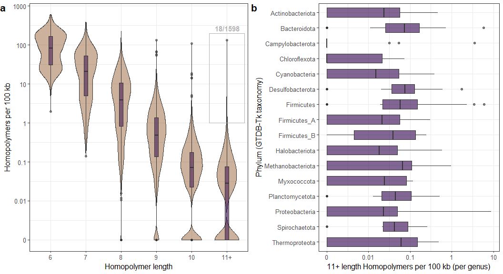

plotting-homopol
================

### Description: R code for wrangling and plotting homopolymer counting results

### Load dependencies

``` r
library(ggplot2)
library(stringr)
library(ggpubr)
library(dplyr)
library(tidyverse)
```

### Load data

``` r
hp=read.delim("hp.txt", sep=" ", header=F)
gtdb=read.delim("gtdb_taxonomy.tsv", sep="\t", header=F)
refseq=read.delim("refseq_species.txt", sep="\t", header=F)
gc=read.delim("gc.txt", sep=" ", header=F)

message("Genomes counted: ",length(unique(hp$V1)))
```

    ## Genomes counted: 24486

### Wrangle data

``` r
colnames(hp) <- c("name","homopol","count")

hp$name <- str_extract(hp$name, "GCF_[0-9.]+")
hp$nuc <- str_extract(hp$homopol, "^.{1}")
hp$homopol = substring(hp$homopol, 2)
hp$homopol = as.integer(hp$homopol)

colnames(gc) <- c("name","length","gc")
gc$name <- str_extract(gc$name, "GCF_[0-9.]+")
gc$gc_bp <- round(gc$length * gc$gc * 0.01,0)

gc_1 <- aggregate(gc$length, by=list(gc$name), FUN=sum)
colnames(gc_1) <- c("name","length")

gc_2 <- aggregate(gc$gc_bp, by=list(gc$name), FUN=sum)
colnames(gc_2) <- c("name","gc_count")

gc <- merge(gc_1,gc_2, by="name")
gc$gc_perc <- gc$gc_count / gc$length * 100
```

### Sum homopolymer counts for all genomes

``` r
hp1 <- hp[(hp$homopol <= 10), ]
hp2 <- hp[(hp$homopol >= 11), ]

hp1_sum <- aggregate(hp1$count, by=list(hp1$nuc,hp1$homopol), FUN=sum)
hp2_sum <- aggregate(hp2$count, by=list(hp2$nuc), FUN=sum)

colnames(hp1_sum) <- c("nuc","len","sum")
colnames(hp2_sum) <- c("nuc","sum")
hp2_sum$len <- "11+"

hp_sum <- rbind(hp1_sum,hp2_sum)
hp_sum <- hp_sum[(hp_sum$nuc == "A" | hp_sum$nuc == "T" | hp_sum$nuc == "G" | hp_sum$nuc == "C"), ]
```

### Plot total homopolymer counts per nucleotide

``` r
level_order <- c("6","7","8","9","10","11+")

plot_hp <- ggplot(data=hp_sum, aes(x=factor(len,level=level_order), y=sum, color=nuc, group = nuc)) + geom_line(size=0.8, alpha=0.25) +
  geom_jitter(size=2, width = 0.08, height = 0) + 
  scale_y_continuous(trans="log10", breaks=c(1e+03,1e+04,1e+05,1e+06,1e+07,1e+08), limits = c(1e+04,1e+08)) + 
  scale_color_manual(values = c("A"="#7f3b08","T"="#fdb863","G"="#2d004b", "C"="#b2abd2")) + theme_bw() +
   theme(legend.position = "right", axis.title.y = element_text(size = 12), axis.title.x = element_text(size = 12), 
         axis.text.x = element_text(size = 10), axis.text.y = element_text(size = 10)) +
  labs(x="Homopolymer length", y="Observed count", color="")

plot_hp
```

<!-- -->

``` r
#ggsave(plot_hp, file="hp_count.pdf", height = 4.5, width = 8, useDingbats=FALSE)
```

### Wrangle gtdb taxonomy

``` r
colnames(gtdb) <- c("name","gtdb_classification")
gtdb$name = substring(gtdb$name, 4)

gtdb$GTDB_domain <- str_extract(gtdb$gtdb_classification, "d__[a-zA-Z0-9 -_]+;p__")
gtdb$GTDB_domain <- gsub("d__", "", gtdb$GTDB_domain)
gtdb$GTDB_domain <- gsub(";p__", "", gtdb$GTDB_domain)
gtdb$GTDB_domain[is.na(gtdb$GTDB_domain)] <- "Unclassified"


gtdb$GTDB_phylum <- str_extract(gtdb$gtdb_classification, "p__[a-zA-Z0-9 -_]+;c__")
gtdb$GTDB_phylum <- gsub("p__", "", gtdb$GTDB_phylum)
gtdb$GTDB_phylum <- gsub(";c__", "", gtdb$GTDB_phylum)
gtdb$GTDB_phylum[is.na(gtdb$GTDB_phylum)] <- "Unclassified"


gtdb$GTDB_class <- str_extract(gtdb$gtdb_classification, ";c__[a-zA-Z0-9 -]+;o__")
gtdb$GTDB_class <- gsub(";c__", "", gtdb$GTDB_class)
gtdb$GTDB_class <- gsub(";o__", "", gtdb$GTDB_class)
gtdb$GTDB_class[is.na(gtdb$GTDB_class)] <- "Unclassified"


gtdb$GTDB_order <- str_extract(gtdb$gtdb_classification, ";o__[a-zA-Z0-9 -]+;f__")
gtdb$GTDB_order <- gsub(";o__", "", gtdb$GTDB_order)
gtdb$GTDB_order <- gsub(";f__", "", gtdb$GTDB_order)
gtdb$GTDB_order[is.na(gtdb$GTDB_order)] <- "Unclassified"


gtdb$GTDB_family <- str_extract(gtdb$gtdb_classification, ";f__[a-zA-Z0-9 -]+;g__")
gtdb$GTDB_family <- gsub(";f__", "", gtdb$GTDB_family)
gtdb$GTDB_family <- gsub(";g__", "", gtdb$GTDB_family)
gtdb$GTDB_family[is.na(gtdb$GTDB_family)] <- "Unclassified"


gtdb$GTDB_genus <- str_extract(gtdb$gtdb_classification, ";g__[a-zA-Z0-9 -]+;s__")
gtdb$GTDB_genus <- gsub(";g__", "", gtdb$GTDB_genus)
gtdb$GTDB_genus <- gsub(";s__", "", gtdb$GTDB_genus)
gtdb$GTDB_genus[is.na(gtdb$GTDB_genus)] <- "Unclassified"


gtdb$GTDB_species <- str_extract(gtdb$gtdb_classification, ";s__[a-zA-Z0-9 -]+")
gtdb$GTDB_species <- gsub(";s__", "", gtdb$GTDB_species)
gtdb$GTDB_species[is.na(gtdb$GTDB_species)] <- "Unclassified"
```

### Add GTDB taxonomy to refseq data and subsample data to unique genus

``` r
hp_gtdb <- merge(hp,gtdb,by="name")

colnames(refseq) <- c("name","species")
hp_refseq <- merge(hp,refseq,by="name")

refseq <- refseq[(refseq$name %in% hp$name),]
refseq$genus <- word(refseq$species, 1)
refseq$genus  <- gsub("[[:punct:]]", "", refseq$genus) 
refseq_g <- refseq[!duplicated(refseq$genus), ]
```

### Sum homopolymer counts for subsampled genomes

``` r
hp1 <- hp_refseq[(hp_refseq$homopol <= 10), ]
hp2 <- hp_refseq[(hp_refseq$homopol >= 11), ]

hp1_sum <- aggregate(hp1$count, by=list(hp1$nuc,hp1$homopol, hp1$name), FUN=sum)
hp2_sum <- aggregate(hp2$count, by=list(hp2$nuc,hp2$name), FUN=sum)

colnames(hp1_sum) <- c("nuc","len","name","sum")
colnames(hp2_sum) <- c("nuc","name","sum")
hp2_sum$len <- "11+"

hp_sum <- rbind(hp1_sum,hp2_sum)
hp_sum <- hp_sum[(hp_sum$nuc == "A" | hp_sum$nuc == "T" | hp_sum$nuc == "G" | hp_sum$nuc == "C"), ]
hp_sum <- merge(hp_sum,refseq_g, by="name")

hp_sum_ <- aggregate(hp_sum$sum, by=list(hp_sum$nuc,hp_sum$len), FUN=sum)
colnames(hp_sum_) <- c("nuc","len","sum")

hp_sum$pair <- ifelse((hp_sum$nuc == "A" | hp_sum$nuc == "T"), "A+T", "G+C")
hp_sum <- aggregate(hp_sum$sum, by=list(hp_sum$pair,hp_sum$len,hp_sum$name), FUN=sum)
colnames(hp_sum) <- c("pair","len","name","sum")
```

### Plot homopolymer sums for subsampled data

``` r
level_order <- c("6","7","8","9","10","11+")

plot_hp <- ggplot(data=hp_sum_, aes(x=factor(len,level=level_order), y=sum, color=nuc, group = nuc)) + geom_line(size=0.8, alpha=0.25) +
  geom_jitter(size=2, width = 0.08, height = 0) + 
  scale_y_continuous(trans="log10", breaks=c(1e+02,1e+03,1e+04,1e+05,1e+06,1e+07), limits = c(1e+02,1e+07)) + 
  scale_color_manual(values = c("A"="#7f3b08","T"="#fdb863","G"="#2d004b", "C"="#b2abd2")) + theme_bw() +
   theme(legend.position = "right", axis.title.y = element_text(size = 12), axis.title.x = element_text(size = 12), 
         axis.text.x = element_text(size = 10), axis.text.y = element_text(size = 10)) +
  labs(x="Homopolymer length", y="Observed count", color="")

plot_hp
```

<!-- -->

``` r
#ggsave(plot_hp, file="hp_count_genus.pdf", height = 4.5, width = 8, useDingbats=FALSE)
```

### Plot homopolymer sums for subsampled data, grouped by base pairs

``` r
level_order <- c("6","7","8","9","10","11+")
message("n=",length(unique(hp_sum$name)))
```

    ## n=1598

``` r
plot_hp_pair <- ggplot(data=hp_sum, aes(x=factor(len,level=level_order), y=sum, color=pair)) + geom_boxplot(alpha=0.8) +
  scale_y_continuous(trans="log10", breaks=c(1,10,100,1000,10000)) + 
  scale_color_manual(values = c("A+T"="#7f3b08","G+C"="#2d004b")) + theme_bw() +
   theme(legend.position = "right", legend.text=element_text(size=12), 
         axis.title.y = element_text(size = 12), axis.title.x = element_text(size = 12), 
         axis.text.x = element_text(size = 10), axis.text.y = element_text(size = 10)) +
  labs(x="Homopolymer length", y="Observed counts", color="")

plot_hp_pair
```

<!-- -->

``` r
#ggsave(plot_hp_pair, file="hp_pair_genus.pdf", height = 4.5, width = 8, useDingbats=FALSE)
```

### Plot homopolymer sums for subsampled data, without grouping by nucleotide

``` r
level_order <- c("6","7","8","9","10","11+")
message("n=",length(unique(hp_sum$name)))
```

    ## n=1598

``` r
hp_sum2 <- aggregate(hp_sum$sum, by=list(hp_sum$len, hp_sum$name), FUN=sum)
colnames(hp_sum2) <- c("len","name","sum")


plot_hp_all <- ggplot(data=hp_sum2, aes(x=factor(len,level=level_order), y=sum, category=len )) + geom_violin(alpha=0.4, fill="#7f3b08") + geom_boxplot(alpha=0.5, width=0.1, fill="#2d004b") +
  scale_y_continuous(trans="log10", breaks=c(1,10,100,1000,10000)) + theme_bw() +
   theme(legend.position = "right", legend.text=element_text(size=12), 
         axis.title.y = element_text(size = 12), axis.title.x = element_text(size = 12), 
         axis.text.x = element_text(size = 10), axis.text.y = element_text(size = 10)) +
  labs(x="Homopolymer length", y="Observed counts", color="")


plot_hp_all
```

<!-- -->

``` r
#ggsave(plot_hp_all, file="hp_all_genus.pdf", height = 4.5, width = 8, useDingbats=FALSE)
```

### Plot homopolymer sums for subsampled data, without grouping by nucleotide and normalized to genome size, where absence of long homopolymers is included in the calculation

``` r
level_order <- c("6","7","8","9","10","11+")
message("n=",length(unique(hp_sum$name)))
```

    ## n=1598

``` r
hp_sum2 <- aggregate(hp_sum$sum, by=list(hp_sum$len, hp_sum$name), FUN=sum)
colnames(hp_sum2) <- c("len","name","sum")
hp_sum2 <- merge(hp_sum2, gc_1, by="name")
hp_sum2$sum_norm <- hp_sum2$sum / (hp_sum2$length / 100000)

# Add 0.001 to missing homopolymer counts for plotting on a log-axis (no change in median value compared to 0)
hp_sum2 <- hp_sum2 %>% select(name, len, sum_norm) %>% pivot_wider(names_from = len, values_from = sum_norm, values_fill =0.001) %>% pivot_longer(!name, names_to="len", values_to="sum_norm")


plot_hp_all_norm <- ggplot(data=hp_sum2, aes(x=factor(len,level=level_order), y=sum_norm, category=len )) + 
  geom_violin(alpha=0.4, fill="#7f3b08") + geom_boxplot(alpha=0.5, width=0.1, fill="#2d004b") +
  scale_y_continuous(trans="log10", breaks=c(0.001,0.01,0.1,1,10,100,1000,10000), labels=c(0,0.01,0.1,1,10,100,1000,10000)) + theme_bw() +
   theme(legend.position = "right", legend.text=element_text(size=12), 
         axis.title.y = element_text(size = 12), axis.title.x = element_text(size = 12), 
         axis.text.x = element_text(size = 10), axis.text.y = element_text(size = 10)) +
  labs(x="Homopolymer length", y="Homopolymers per 100 kb", color="") + 
  geom_rect(mapping=aes(xmin=5.5, xmax=6.5, ymin=1, ymax=200), alpha=0, color="gray70") +
  annotate(geom = "text", x = 5.67, y = 270, size=4, color = "gray70", hjust = 0, fontface=2,
         label = paste(nrow(hp_sum2[(hp_sum2$len == "11+" & hp_sum2$sum_norm > 1), ]),"/",nrow(hp_sum2[(hp_sum2$len == "6"), ]),sep=""))


plot_hp_all_norm
```

<!-- -->

``` r
#ggsave(plot_hp_all_norm, file="hp_all_genus_norm.pdf", height = 4.5, width = 8, useDingbats=FALSE)
```

### From subsampled genomes, pick entries with 11+ homopolymer length and plot counts by GC content, grouped by base pairs

``` r
hp_sum_11 <- hp_sum[(hp_sum$len == "11+"), ]
hp_sum_11 <- merge(hp_sum_11, gc, by="name")
message("n=",length(unique(hp_sum_11$name)))
```

    ## n=1053

``` r
plot_hp_long_gc <- ggplot(data=hp_sum_11, aes(x=gc_perc, y=sum, color=pair)) + 
  geom_line(aes(group=name),col="black", size=0.3, alpha =0.6)  + geom_point(alpha=0.75, size=1.75) +
  scale_color_manual(values = c("A+T"="#7f3b08","G+C"="#2d004b")) + theme_bw() + 
   scale_y_continuous(limits = c(0,50), expand=c(0,0)) + 
  scale_x_continuous(breaks = c(15,30,45,60,75), limits = c(20,80), expand = c(0,0)) + 
  labs(y="Homopolymers with +11 length", x="GC content (%)", color="") +
   theme(legend.position = "right", axis.title.y = element_text(size = 12), axis.title.x = element_text(size = 12), 
         axis.text.x = element_text(size = 10), axis.text.y = element_text(size = 10))

plot_hp_long_gc
```

<!-- -->

``` r
#ggsave(hp_long_gc, file="hp_long_gc.pdf", height = 4.5, width = 8, useDingbats=FALSE)
```

### Plot 11+ homopolymer rates by GTDB phyla with subsampled genomes, no grouping by nucleotide, and homopolymer absence included

``` r
hp_sum_11_p <- merge(hp_sum2[(hp_sum2$len == "11+"), ], gtdb, by="name")
message("n=",length(unique(hp_sum_11_p$name)))
```

    ## n=1149

``` r
plot_hp_long_p <- ggplot(data=hp_sum_11_p, aes(x=GTDB_phylum, y=sum_norm)) + geom_boxplot(alpha=0.6, width=0.6, fill="#2d004b") +
  labs(y="11+ length Homopolymers per 100 kb (per genus)", x="Phylum (GTDB-Tk taxonomy)", color="") + theme_bw() + scale_x_discrete(limits=rev) +
  scale_y_continuous(breaks=c(0.001,0.01,0.1,1,10,100), labels=c(0,0.01,0.1,1,10,100), trans="log10") +
    theme(legend.position = "right", legend.text=element_text(size=12), 
         axis.title.y = element_text(size = 12), axis.title.x = element_text(size = 12), 
         axis.text.x = element_text(size = 10), axis.text.y = element_text(size = 10)) + coord_flip()

plot_hp_long_p
```

<!-- -->

``` r
#ggsave(plot_hp_long_p, file="hp_long_phyl.pdf", height = 10, width = 8, useDingbats=FALSE)
```

### Combine normalized homopolymer count plots

``` r
fig_hp <- ggarrange(plot_hp_all_norm, plot_hp_long_p, ncol=2, nrow=1, common.legend = TRUE, legend = "bottom", 
                  labels = c("a", "b"), font.label = list(size = 16), hjust=0.01)

fig_hp
```

<!-- -->

``` r
ggsave(fig_hp, file="fig_hp.pdf", height = 7.5, width = 11, useDingbats=FALSE)
```
