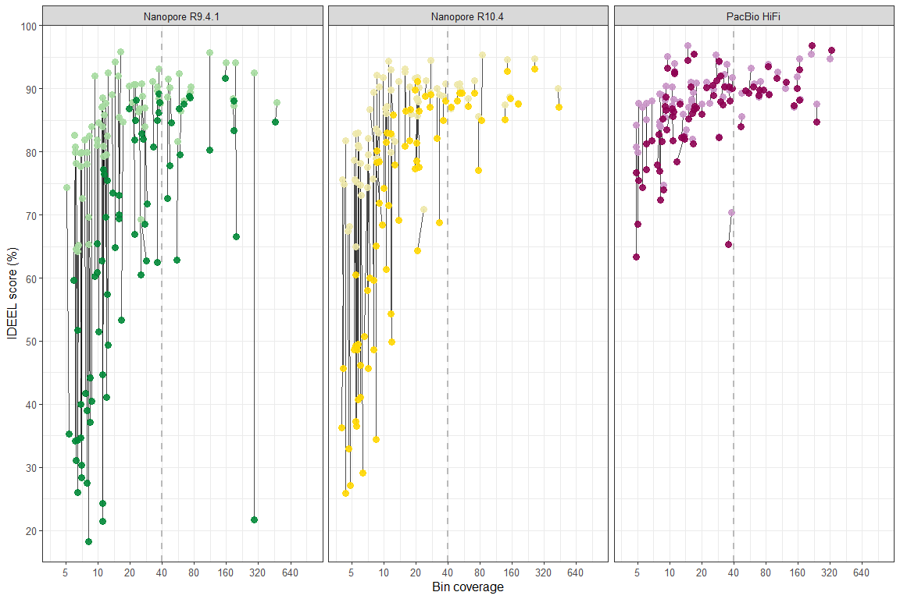

plotting-ideel-subset
================

### Description: R code for generating an IDEEL plot for clustered MAGs

### Load dependencies

``` r
library(ggplot2)
library(stringr)
library(dplyr)
library(ggpubr)
library(tidyverse)
```

### Load data

#### The results for R9.4.1 have ben acquried from a subsampled dataset

``` r
bins=read.table("bins_subset.tsv", sep="\t", header=T)
```

### Get list of clustered MAGs

``` r
bins_clust <- bins[(bins$mags_workflow_name == "r9" | bins$mags_workflow_name == "r104" | bins$mags_workflow_name == "pbccs" |
                      bins$mags_workflow_name == "r9-il" & bins$cov_ilm >= 5 |
                      bins$mags_workflow_name == "r104-il" & bins$cov_ilm >= 5 |
                      bins$mags_workflow_name == "pbccs-il" & bins$cov_ilm >= 5), ]

bins_clust <- bins_clust[!is.na(bins_clust$secondary_cluster), ]
bins_clust <- bins_clust %>% group_by(bins_clust$secondary_cluster) %>% dplyr::filter(n() == 6)
list_clust <- bins_clust[,1]
list_clust$id_bin <- paste(list_clust$id_bin,".fa",sep="")
#write.table(list_clust,"list_bins.csv", quote=F,row.names=FALSE,col.names=FALSE)
```

### Load ideel data

``` r
R9=read.table("ideel/prot_r9.tsv", sep="\t", header=F)
R9$datatype="Nanopore R9.4.1"

R9_ILM=read.table("ideel/prot_r9-il.tsv", sep="\t", header=F)
R9_ILM$datatype="Nanopore R9.4.1 + Illumina"

R104=read.table("ideel/prot_r104.tsv", sep="\t", header=F)
R104$datatype="Nanopore R10.4"

R104_ILM=read.table("ideel/prot_r104-il.tsv", sep="\t", header=F)
R104_ILM$datatype="Nanopore R10.4 + Illumina"

PBCCS=read.table("ideel/prot_pbccs.tsv", sep="\t", header=F)
PBCCS$datatype="PacBio HiFi"

PBCCS_ILM=read.table("ideel/prot_pbccs-il.tsv", sep="\t", header=F)
PBCCS_ILM$datatype="PacBio HiFi + Illumina"
```

### Process ideel data

``` r
# Only use hits that are shared across multiple datasets
R9 <- R9[(R9$V2 %in% R9_ILM$V2),]
R9 <- R9[(R9$V2 %in% R104$V2),]
R9 <- R9[(R9$V2 %in% R104_ILM$V2),]
R9 <- R9[(R9$V2 %in% PBCCS$V2),]
R9 <- R9[(R9$V2 %in% PBCCS_ILM$V2),]

data <- rbind(R9,R9_ILM,R104,R104_ILM,PBCCS,PBCCS_ILM)
data <- data[(data$V2 %in% R9$V2),]

colnames(data) <- c("query_id", "subject_id","query_len","subject_len","aligned_len","query_start","query_end",
                  "subject_start","subject_end","e_value","bit_score", "percent_identity", "N_identical",
                  "N_mismatch", "N_postive", "N_gaps", "datatype")

data$qLen_sLen_ratio <- data$query_len/data$subject_len
```

### Load contig-bin links

``` r
L_R9=read.table("links/r9.tsv", sep="\t", header=F)
L_R9_IL=read.table("links/r9-il.tsv", sep="\t", header=F)

L_R104=read.table("links/r104.tsv", sep="\t", header=F)
L_R104_IL=read.table("links/r104-il.tsv", sep="\t", header=F)

L_PB=read.table("links/pbccs.tsv", sep="\t", header=F)
L_PB_IL=read.table("links/pbccs-il.tsv", sep="\t", header=F)
```

### Get IDEEL scores for MAGs

``` r
wrangle_ideel <- function(ideel,links,type) {

ideel$V1 <- gsub("_[0-9]+$", "", ideel$V1)
colnames(ideel) <- c("contig", "subject_id","query_len","subject_len","aligned_len","query_start","query_end",
                  "subject_start","subject_end","e_value","bit_score", "percent_identity", "N_identical",
                  "N_mismatch", "N_postive", "N_gaps", "datatype")
colnames(links) <- c("contig", "bin")
ideel <- merge(ideel,links,by="contig")

ideel$qLen_sLen_ratio <- ideel$query_len/ideel$subject_len
ideel$status <- ifelse((ideel$qLen_sLen_ratio >= 0.95), 1, 0)

ideel_all <- aggregate(ideel$status, by=list(Category=ideel$bin), FUN=length)
ideel_full <- aggregate(ideel$status, by=list(Category=ideel$bin), FUN=sum)
ideel_count <- merge(ideel_all,ideel_full,by="Category")
colnames(ideel_count) <- c("id_bin","ideel_all","ideel_full")
ideel_count$ideel_frac <- ideel_count$ideel_full / ideel_count$ideel_all
ideel_count$id_bin <- paste(type,ideel_count$id_bin,sep="_")

return(ideel_count)}


L_R9 <- wrangle_ideel(R9,L_R9,"r9")
L_R9_IL <- wrangle_ideel(R9_ILM,L_R9_IL,"r9-il")

L_R104 <- wrangle_ideel(R104,L_R104,"r104")
L_R104_IL <- wrangle_ideel(R104_ILM,L_R104_IL,"r104-il")

L_PB <- wrangle_ideel(PBCCS,L_PB,"pbccs")
L_PB_IL <- wrangle_ideel(PBCCS_ILM,L_PB_IL,"pbccs-il")

bins_ideel <- rbind(L_R9,L_R9_IL,L_R104,L_R104_IL,L_PB, L_PB_IL)
bins_ideel <- merge(bins_clust,bins_ideel,by="id_bin")

bins_ideel$index <- ifelse(str_detect(bins_ideel$mags_workflow_name,"r9"), "r9",
                             ifelse(str_detect(bins_ideel$mags_workflow_name,"r104"), "r104", "pb"))
bins_ideel$index2 <- paste(bins_ideel$index, bins_ideel$secondary_cluster, sep="_")
```

### IDEEL score plot

``` r
bins_ideel$index  <- gsub('r9', "Nanopore R9.4.1", bins_ideel$index, fixed=TRUE)
bins_ideel$index  <- gsub('r104', "Nanopore R10.4", bins_ideel$index, fixed=TRUE)
bins_ideel$index  <- gsub('pb', "PacBio HiFi", bins_ideel$index, fixed=TRUE)

bins_ideel$index  <- factor(bins_ideel$index , levels = c("Nanopore R9.4.1","Nanopore R10.4","PacBio HiFi"))
bins_ideel$mags_workflow_name <- factor(bins_ideel$mags_workflow_name, levels=c("r9","r9-il","r104","r104-il","pbccs","pbccs-il"))

plot_ideel_bin <- ggplot(data=bins_ideel,aes(x=cov_long,y=ideel_frac*100)) + 
  geom_line(aes(group=index2),col="black", size=0.4, alpha =0.7) +
  geom_point(aes(col=mags_workflow_name), alpha=0.9, size=3)   + theme_bw() +
  scale_x_continuous(breaks=c(2,5,10,20,40,80,160,320,640),trans = "log2", limits=c(3,1280),expand=c(0,0)) +
  scale_y_continuous(breaks=c(20,30,40,50,60,70,80,90,100),limits=c(15,100), expand=c(0,0))  +
  scale_color_manual(values = c("r9"="#008837", "r9-il"="#a6dba0",
                                "r104"="#ffd700","r104-il"="#eee8aa",
                                "pbccs"="#8e0152","pbccs-il"="#c994c7"))  +
  theme(legend.position = "none",legend.text=element_text(size=12), axis.title.y = element_text(size = 12),
  axis.title.x = element_text(size = 12), axis.text.x = element_text(size = 10), axis.text.y = element_text(size = 10),
  legend.title = element_text(size=9), strip.text = element_text(size=10)) + 
  labs(col="",y="IDEEL score (%)",x="Bin coverage") + geom_vline(aes(xintercept = 40), size=0.75, lty=2, color="grey70", alpha=0.9)+
  facet_grid(. ~index)

plot_ideel_bin <- plot_ideel_bin + guides(colour = guide_legend(nrow = 1))
plot_ideel_bin
```

<!-- -->

``` r
plot_ideel_bin <- annotate_figure(plot_ideel_bin, bottom = text_grob("Nanopore R9.4.1", size = 12, vjust = -6.4, hjust = 2.92,
                                                                     color = "#008837", face = "bold"))
plot_ideel_bin <- annotate_figure(plot_ideel_bin, bottom = text_grob("Nanopore R10.4", size = 12, vjust = -8.3, hjust = 0,
                                                                     color = "#ffd700", face = "bold"))
plot_ideel_bin <- annotate_figure(plot_ideel_bin, bottom = text_grob("Pacbio HiFi", size = 12, vjust = -10, hjust = -4.2,
                                                                     color = "#8e0152", face = "bold"))
plot_ideel_bin <- annotate_figure(plot_ideel_bin, bottom = text_grob("+ Illumina", size = 12, vjust = -11.9, hjust = 3.27,
                                                                     color = "#a6dba0", face = "bold"))
plot_ideel_bin <- annotate_figure(plot_ideel_bin, bottom = text_grob("+ Illumina", size = 12, vjust = -13.83, hjust = -1.65,
                                                                     color = "#eee8aa", face = "bold"))
plot_ideel_bin <- annotate_figure(plot_ideel_bin, bottom = text_grob("+ Illumina", size = 12, vjust = -15.55, hjust = -6.08,
                                                                     color = "#c994c7", face = "bold"))
plot_ideel_bin <- plot_ideel_bin + theme(plot.margin=unit(c(0,0,-0.135,0), "null"))
ggsave(plot_ideel_bin, file="ideel_bin.pdf", height = 8, width = 12, useDingbats=FALSE)
```

### Count differences in ideel scores for MAGs above 40x cov

``` r
ideel_diff <- function(df,cov,index,pre,post) {

df <- df[(df$cov_long >= cov & df$index == index), ] %>%
  select(index2,ideel_frac,mags_workflow_name) %>% 
  pivot_wider(names_from = mags_workflow_name, values_from = ideel_frac)

df$diff <- unlist(round((df[,post] - df[,pre])*100,2))
df <- as.data.frame(df)

return(df)}

bins_ideel_r9 <- ideel_diff(bins_ideel,40,"Nanopore R9.4.1","r9","r9-il")
bins_ideel_r104 <- ideel_diff(bins_ideel,40,"Nanopore R10.4","r104","r104-il")
bins_ideel_pb <- ideel_diff(bins_ideel,40,"PacBio HiFi","pbccs","pbccs-il")


message("Nanopore R9.4.1: median increase of ",median(bins_ideel_r9[,4])," for ",nrow(bins_ideel_r9),
        " MAGs, less than 5 in ",nrow(bins_ideel_r9[(bins_ideel_r9$diff <= 5), ]))
```

    ## Nanopore R9.4.1: median increase of 5.56 for 16 MAGs, less than 5 in 6

``` r
message("Nanopore R10.4: median increase of ",median(bins_ideel_r104[,4])," for ",nrow(bins_ideel_r104),
        " MAGs, less than 5 in ",nrow(bins_ideel_r104[(bins_ideel_r104$diff <= 5), ]))
```

    ## Nanopore R10.4: median increase of 1.73 for 14 MAGs, less than 5 in 12

``` r
message("PacBio HiFi: median increase of ",median(bins_ideel_pb[,4])," for ",nrow(bins_ideel_pb),
        " MAGs, less than 5 in ",nrow(bins_ideel_pb[(bins_ideel_pb$diff <= 5), ]))
```

    ## PacBio HiFi: median increase of 0.27 for 18 MAGs, less than 5 in 18
