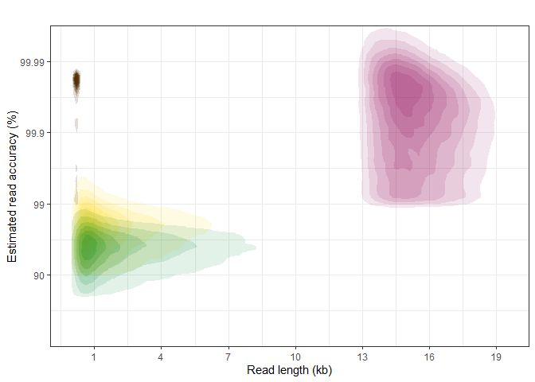
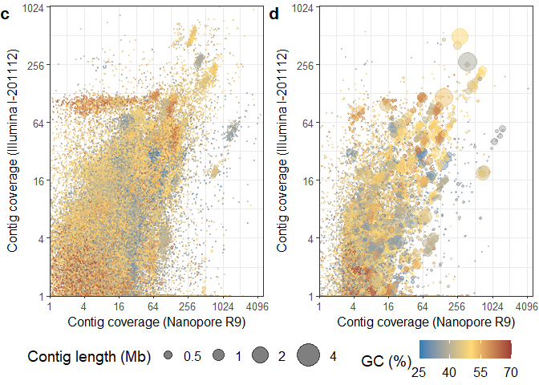
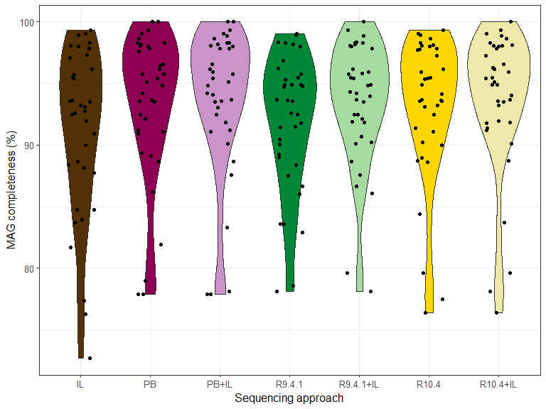
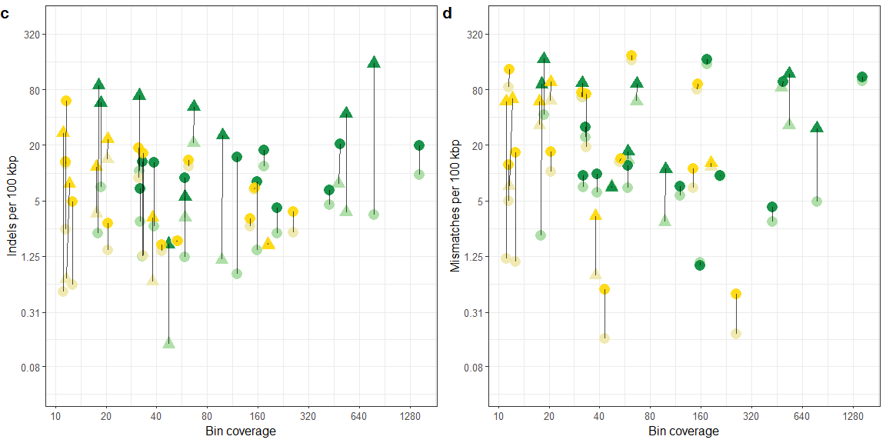
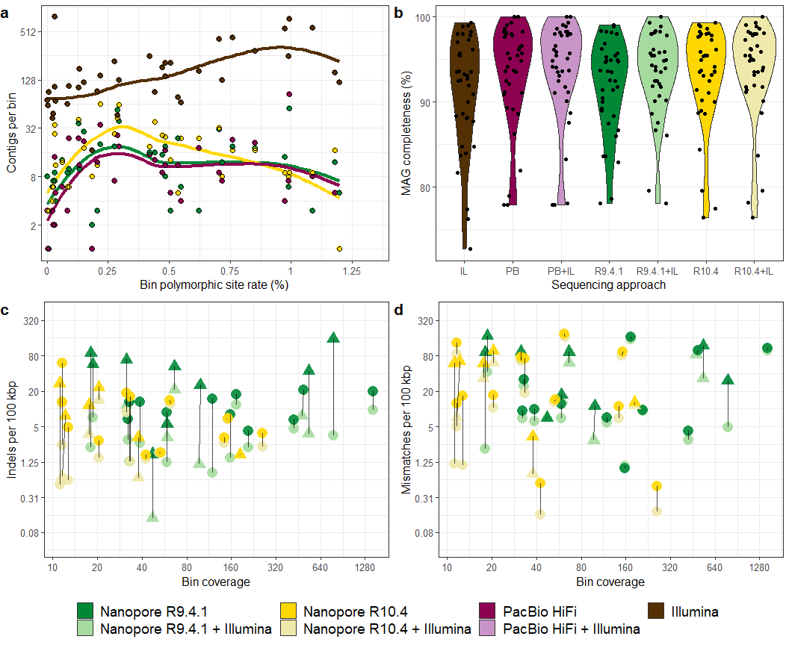

Plotting-mags
================

### Description: R code for generating plots for metagenomic data from different sequencing approaches

### Load dependencies

``` r
library(ggplot2)
library(ggpubr)
library(data.table)
library(tidyverse)
library(dplyr)
library(stringi)
library(grid)
```

### Load bin data and NanoPlot datasets for read/contig features.

#### mp\_reads\_\* were generated by mapping the reads to the PacBio CCS assembly. The read datasets were randomly subsampled to 100,000 reads.

``` r
bins=read.table("bins.tsv", sep="\t", header=T)
bins = bins[(bins$Genome_size_bp > 500000), ]

reads_r9=read.table("reads-len-q/r9_100k.tsv", sep="\t", header=F) 
reads_r104=read.table("reads-len-q/r104_100k.tsv", sep="\t", header=F) 
reads_pb=read.table("reads-len-q/pb_100k.tsv", sep="\t", header=F)
reads_il=read.table("reads-len-q/il_100k.tsv", sep="\t", header=F)

mp_reads_r9=read.table("nanoplot_map/map_r9_100k.tsv", sep="\t", header=F) 
mp_reads_r104=read.table("nanoplot_map/map_r104_100k.tsv", sep="\t", header=F) 
mp_reads_pb=read.table("nanoplot_map/map_pb_100k.tsv", sep="\t", header=F)
mp_reads_il=read.table("nanoplot_map/map_il_100k.tsv", sep="\t", header=F)

contigs_r9=read.table("contigs-len/contigs_r9.tsv", sep="\t", header=T)
contigs_r104=read.table("contigs-len/contigs_r104.tsv", sep="\t", header=T)
contigs_pb=read.table("contigs-len/contigs_pbccs.tsv", sep="\t", header=T)
contigs_il=read.table("contigs-len/contigs_ilmn.tsv", sep="\t", header=T)
```

### Get general MAG summaries

``` r
# MAG count by quality and sequencing approach
mags <- as.data.frame.matrix(with(bins, table(MAG_status, mags_workflow_name)))
mags[5,] = colSums(mags[,1:8])
rownames(mags)[5] <- "Total"
mags <- add_rownames(mags, var = "status")
mags$status <- factor(mags$status, levels = c("HQ", "MQ","LQ","Contaminated", "Total"))

mags <- mags[order(mags$status),]
col_order <- c("status", "ilmn", "r9", "r9-il","r104", "r104-il", "pbccs")
mags <- mags[, col_order]
mags
```

    ## # A tibble: 5 x 7
    ##   status        ilmn    r9 `r9-il`  r104 `r104-il` pbccs
    ##   <fct>        <dbl> <dbl>   <dbl> <dbl>     <dbl> <dbl>
    ## 1 HQ               8    64      86    34        36    74
    ## 2 MQ              83   114      95    65        67    72
    ## 3 LQ               3    28      25     9        10    20
    ## 4 Contaminated    10     6      13     5         6    14
    ## 5 Total          104   212     219   113       119   180

``` r
# Circular MAGs
cmags <- as.data.frame.matrix(with(bins, table(cMAG_status, mags_workflow_name)))

# Contigs per MAG
mags_contigs <- aggregate(bins$contigs, by=list(bins$mags_workflow_name,bins$MAG_status), FUN=median)

# MAG sizes
mags_size <- aggregate(bins$Genome_size_bp, by=list(bins$mags_workflow_name), FUN=sum)
mags_size$x <- mags_size$x/1000000

mags_hq_size <- aggregate(bins[(bins$MAG_status == "HQ"), ]$Genome_size_bp,
                          by=list(bins[(bins$MAG_status == "HQ"), ]$mags_workflow_name), FUN=sum)
mags_hq_size$x <- mags_hq_size$x/1000000
```

### Get estimated/observed modal read accuracies

``` r
estimate_mode <- function(x) {
  d <- density(x)
  d$x[which.max(d$y)] }


message("Modal estimated accuracies estimated from Q scores")
message("ILM: ",round((1-10**(-estimate_mode(mp_reads_il$V1)/10))*100,2), " %")
message("PBCCS: ",round((1-10**(-estimate_mode(mp_reads_pb$V2)/10))*100,2), " %")
message("R9: ",round((1-10**(-estimate_mode(mp_reads_r9$V2)/10))*100,2), " %")
message("R104: ",round((1-10**(-estimate_mode(mp_reads_r104$V2)/10))*100,2), " %")


message("Modal observed accuracies estimated from Q scores")
message("ILM: ",round((estimate_mode(mp_reads_il$V6)),2), " %")
message("PBCCS: ",round((estimate_mode(mp_reads_pb$V7)),2), " %")
message("R9: ",round((estimate_mode(mp_reads_r9$V7)),2), " %")
message("R104: ",round((estimate_mode(mp_reads_r104$V7)),2), " %")
```

### 2D density plot for read lengths/estimated accuracy

``` r
plot_reads <- ggplot() +
stat_density_2d(data=reads_il,aes(x=V2, y=V1, alpha = ..level.., fill = "Illumina"), geom = "polygon") +
stat_density_2d(data=reads_r104,aes(x=V2, y=V1, alpha = ..level.., fill = "Nanopore R10.4"), geom = "polygon") +
stat_density_2d(data=reads_r9,aes(x=V2, y=V1, alpha = ..level.., fill = "Nanopore R9"), geom = "polygon") +
stat_density_2d(data=reads_pb,aes(x=V2, y=V1, alpha = ..level.., fill = "PacBio CCS"), geom = "polygon") +
scale_x_continuous(limits= c(0,19500), 
                     breaks = c(1000,4000,7000,10000,13000,16000,19000), labels=c(1,4,7,10,13,16,19)) + 
  theme(legend.position = "bottom", legend.text=element_text(size=10), axis.title.y = element_text(size = 12),
        axis.title.x = element_text(size = 12), axis.text.x = element_text(size = 10), 
        axis.text.y = element_text(size = 10)) + theme_bw() +
  labs(title="", y="Estimated read accuracy (%)", x="Read length (kb)", fill="") + 
  scale_y_continuous(expand = c(0, 0), limits= c(0,45), breaks = c(10,20,30,40), labels = c("90","99","99.9","99.99")) +
  scale_fill_manual(name = " ", 
                    values = c("Nanopore R9" = "#008837",
                               "Nanopore R10.4"="#ffd700",
                               "PacBio CCS" = "#8e0152", 
                               "Illumina" = "#543005")) +
  theme(legend.position = "none", legend.direction = "horizontal",legend.text=element_text(size=12)) +
  guides(alpha = FALSE)

plot_reads
```

<!-- -->

### Metagenome Nx plot

``` r
get_Ns <- function(df_nanoplot, sample = NA){
  df_nanoplot = df_nanoplot %>% select(lengths) %>% dplyr::filter(lengths > 1000)
  size <- sum(df_nanoplot$lengths)
  sorted <- sort(df_nanoplot$lengths, decreasing = T)
  cmsumlen <- cumsum(sorted)
  sfn <- sapply(1:99, function(n) which.min(cmsumlen <= size/(100/n)))
  sfl <- sorted[sfn];
  data <- data.frame(Nx = 1:99, Lx = sfn, bp = sfl, Mbp = sfl/10^6, sample)
  return(data)}

N_pb <- get_Ns(contigs_pb, sample = "PacBio CCS")
N_r9 <- get_Ns(contigs_r9, sample = "Nanopore R9")
N_r104 <- get_Ns(contigs_r104, sample = "Nanopore R10.4")
N_il <- get_Ns(contigs_il, sample = "Illumina")

Nx <- rbind(N_pb, N_r9, N_r104, N_il)

plot_Nx <- ggplot(data=Nx,aes(x=Nx,y=Mbp)) + geom_smooth(aes(color=sample), size=1.7, alpha=0.8, se = FALSE) +
  scale_y_continuous(expand = c(0, 0), breaks=c( 1, 2, 3, 4), limits = c(0,5)) + 
  scale_x_continuous(expand = c(0, 0)) + theme_bw() +  coord_cartesian(ylim=c(0,3.5), xlim = c(0,101)) +
  theme(legend.text=element_text(size=14), axis.title.y = element_text(size = 12), axis.title.x = element_text(size = 12),
        axis.text.x = element_text(size = 10), axis.text.y = element_text(size = 10), legend.position = "none") +
scale_color_manual(values = c("Illumina" = "#543005", "Nanopore R9"="#008837", "Nanopore R10.4"="#ffd700", "PacBio CCS"="#8e0152")) + xlab("Nx") + ylab("Contig length (Mb)")

plot_Nx
```

<!-- -->

### Load even more contig data

``` r
# R9.4.1 data
contigs_r9_2=read.delim("contigs-full/r9-il_contigs.tsv", sep="\t", header=T)
contigs_r9_gc=read.delim("contigs-full/r9_gc.ssf", sep=" ", header=T)

names(contigs_r9_gc)[1] <- "contig"
contigs_r9_2=merge(contigs_r9_2,contigs_r9_gc, by="contig")

cov_r9_1=read.delim("contigs-full/r9_cov_r9.tsv", sep="\t", header=T)
cov_r9_2=read.delim("contigs-full/r9_cov_il.tsv", sep="\t", header=T)

names(cov_r9_1)[1] <- "contig"
names(cov_r9_1)[4] <- "cov_r9"

names(cov_r9_2)[1] <- "contig"
names(cov_r9_2)[4] <- "cov_il"

cov_r9_1 <- cov_r9_1 %>% select(contig,cov_r9)
cov_r9_2 <- cov_r9_2 %>% select(contig,cov_il)

contigs_r9_2 <- merge(contigs_r9_2,cov_r9_1, by="contig")
contigs_r9_2 <- merge(contigs_r9_2,cov_r9_2, by="contig")


# Illumina data
contigs_il_2=read.delim("contigs-full/contigs_ilm.tsv", sep="\t", header=T)
contigs_il_gc=read.delim("contigs-full/il_gc.ssf", sep=" ", header=T)

names(contigs_il_gc)[1] <- "contig"
contigs_il_2=merge(contigs_il_2,contigs_il_gc, by="contig")

cov_il_1=read.delim("contigs-full/il_cov_r9.tsv", sep="\t", header=T)
cov_il_2=read.delim("contigs-full/il_cov_il.tsv", sep="\t", header=T)

names(cov_il_1)[1] <- "contig"
names(cov_il_1)[4] <- "cov_r9"

names(cov_il_2)[1] <- "contig"
names(cov_il_2)[4] <- "cov_il"

cov_il_1 <- cov_il_1 %>% select(contig,cov_r9)
cov_il_2 <- cov_il_2 %>% select(contig,cov_il)

contigs_il_2 <- merge(contigs_il_2,cov_il_1, by="contig")
contigs_il_2 <- merge(contigs_il_2,cov_il_2, by="contig")
```

### Differential coverage plot: Illumina vs R9.4.1

``` r
plot_cont_il <- ggplot(data=contigs_il_2,aes(x=cov_r9,y=cov_il, color=GC))  + geom_point(aes(size=contig_len_bp/1000000), alpha=0.5) +
  xlab("Contig coverage (Nanopore R9)") + ylab("Contig coverage (Illumina I-201112)") + theme_bw() +
  scale_x_continuous(trans="log2", breaks=c(1,4,16,64,256,1024,4096), limits = c(1,5200), expand = c(0,0)) + 
  scale_y_continuous(trans="log2", breaks=c(1,4,16,64,256,1024), limits = c(1,1050), expand = c(0,0)) +
  theme(legend.position = "right", legend.text=element_text(size=12), axis.title.y = element_text(size = 12),
      axis.title.x = element_text(size = 12), axis.text.x = element_text(size = 10),
      axis.text.y = element_text(size = 10),  legend.title = element_text(size=14)) +
  scale_color_gradient2(midpoint = 50, low = "#2c7fb8", mid= "#fed976", high = "#800026", limits=c(25,70), breaks=c(25,40,55,70)) +
  scale_size_area(breaks=c(0.5,1,2,4), labels=c(0.5,1,2,4), max_size = 12, limits=c(0.001,6)) +
  labs(col="GC (%)", size="Contig length (Mb)") 


plot_cont_r9 <- ggplot(data=contigs_r9_2,aes(x=cov_r9,y=cov_il, color=GC))  + geom_point(aes(size=contig_len_bp/1000000), alpha=0.5) +
  xlab("Contig coverage (Nanopore R9)") + ylab("Contig coverage (Illumina I-201112)") + theme_bw() +
  scale_x_continuous(trans="log2", breaks=c(1,4,16,64,256,1024,4096), limits = c(1,5200), expand = c(0,0)) + 
  scale_y_continuous(trans="log2", breaks=c(1,4,16,64,256,1024), limits = c(1,1050), expand = c(0,0)) +
  theme(legend.position = "right", legend.text=element_text(size=12), axis.title.y = element_text(size = 12),
      axis.title.x = element_text(size = 12), axis.text.x = element_text(size = 10),
      axis.text.y = element_text(size = 10),legend.title = element_text(size=14)) +
  scale_color_gradient2(midpoint = 50, low = "#2c7fb8", mid= "#fed976", high = "#800026", limits=c(25,70), breaks=c(25,40,55,70)) +
  scale_size_area(breaks=c(0.5,1,2,4), labels=c(0.5,1,2,4), max_size = 12, limits=c(0.001,6)) +
  labs(col="GC (%)", size="Contig length (Mb)") 


cov_plot <- ggarrange(plot_cont_il,plot_cont_r9, ncol=2, nrow=1, common.legend = TRUE, legend = "bottom", labels = c("(c)", "(d)"), hjust=0.01, font.label = list(size = 16))
cov_plot
```

<!-- -->

### MAG fragmentation per SNP rates (PacBio data) accross clustered bins

``` r
bins_snp <- bins

bins_snp <- bins_snp[(bins_snp$mags_workflow_mode == "Nanopore R9.4.1" & bins_snp$cov_r9 >= 10 | 
                        bins_snp$mags_workflow_mode == "Nanopore R10.4" & bins_snp$cov_r104 >= 10 |
                      bins_snp$mags_workflow_mode == "PacBio CCS" & bins_snp$cov_pb >= 10 |
                      bins_snp$mags_workflow_mode == "Illumina" & bins_snp$cov_il >= 10), ]

bins_snp <- bins_snp[!is.na(bins_snp$cluster), ]
bins_snp <- bins_snp %>% group_by(bins_snp$cluster) %>% dplyr::filter(n() == 4)

bins_snp2 <- bins_snp[(bins_snp$mags_workflow_mode == "PacBio CCS"), ] %>% select(cluster,percent_snp_rate)
names(bins_snp2)[names(bins_snp2) == 'percent_snp_rate'] <- 'percent_snp_rate_pb'
bins_snp <- merge(bins_snp,bins_snp2, by="cluster")

bins_snp$mags_workflow_mode <- factor(bins_snp$mags_workflow_mode, levels = c("Illumina","Nanopore R9.4.1","Nanopore R10.4","PacBio CCS"))

plot_snp <- ggplot(data=bins_snp,aes(x=percent_snp_rate_pb,y=contigs)) +
  geom_smooth(aes(color=mags_workflow_mode), size=1.5, alpha=0.2, se = FALSE) + theme_bw() +
geom_point(aes(fill=mags_workflow_mode, colour=mags_workflow_mode), size=2.5) + geom_point(shape = 1,size = 2.2,colour = "black") +
theme(legend.text=element_text(size=12), axis.title.y = element_text(size = 12), axis.title.x = element_text(size = 12),
        axis.text.x = element_text(size = 10), axis.text.y = element_text(size = 10), legend.position = "none") + 
  scale_y_continuous(trans = "log2", breaks=c(2,8,32,128,512)) + 
  scale_x_continuous(breaks=c(0,0.25,0.5,0.75,1,1.25,1.5,2,1.75), expand=c(0,0), labels=c(0,0.25,0.5,0.75,1,1.25,1.5,2,1.75), limits = c(-0.025,1.4))+
xlab("Bin polymorphic site rate (%)") + ylab("Contigs per bin") + labs(color="") +
scale_color_manual(values = c("Illumina" = "#543005", "Nanopore R9.4.1"="#008837", 
                              "Nanopore R10.4"="#ffd700", "PacBio CCS"="#8e0152"))

plot_snp
```

<!-- -->

### MAG completeness values accross clustered MAGs

``` r
bins_compl <-  bins[((bins$mags_workflow_mode=="PacBio CCS" & bins$cov_pb >= 10) |
                     (bins$mags_workflow_mode=="Nanopore R9.4.1" & bins$cov_r9 >= 10) |
            (bins$mags_workflow_mode=="Nanopore R9.4.1 + Illumina" & bins$cov_r9 >= 10 & bins$cov_il >= 5) |
            (bins$mags_workflow_mode == "Illumina" & bins$cov_il >= 10) |
            (bins$mags_workflow_mode=="Nanopore R10.4 + Illumina" & bins$cov_r104 >= 10 & bins$cov_il >= 5) |
                     (bins$mags_workflow_mode=="Nanopore R10.4" & bins$cov_r104 >= 10)), ]

bins_compl <- bins_compl[!is.na(bins_compl$cluster), ]
bins_compl <- bins_compl  %>% group_by(bins_compl$cluster) %>% dplyr::filter(n() == 6)

bins_compl$mags_workflow_mode <- gsub("Nanopore ",'NP-', bins_compl$mags_workflow_mode, fixed = TRUE)
bins_compl$mags_workflow_mode <- gsub("Illumina","IL", bins_compl$mags_workflow_mode, fixed = TRUE)
bins_compl$mags_workflow_mode <- gsub("PacBio CCS","PBCCS", bins_compl$mags_workflow_mode, fixed = TRUE)
bins_compl$mags_workflow_mode <- gsub(" ","", bins_compl$mags_workflow_mode, fixed = TRUE)

level_order <- c("IL","PBCCS","NP-R9.4.1","NP-R9.4.1+IL","NP-R10.4","NP-R10.4+IL")
bins_compl$mags_workflow_mode <- factor(bins_compl$mags_workflow_mode, levels = c("IL","PBCCS","NP-R9.4.1","NP-R9.4.1+IL", "NP-R10.4","NP-R10.4+IL"))

Completeness <- data.frame(rbind(tapply(bins_compl$Completeness,bins_compl$mags_workflow_mode, mean), tapply(bins_compl$Completeness,bins_compl$mags_workflow_mode, sd)))

plot_compl <- ggplot(data=bins_compl,aes(x=factor(mags_workflow_mode,level=level_order),y=Completeness)) +
geom_violin(aes(fill=mags_workflow_mode)) + geom_jitter(position = position_jitter(width = 0.2, height = 0.15)) + theme_bw() +
ylab("MAG completeness (%)") + xlab("Sequencing approach") + labs(fill="") + guides(fill = guide_legend(nrow = 1)) +
  scale_x_discrete(guide = guide_axis(angle = 30)) +
theme(legend.position = "none", legend.text=element_text(size=14), axis.title.y = element_text(size = 12), axis.title.x = element_text(size = 12),
        axis.text.x = element_text(size = 10), axis.text.y = element_text(size = 10), legend.title = element_text(size=13)) + scale_fill_manual(values = c("IL" = "#543005", "NP-R9.4.1"="#008837", "NP-R9.4.1+IL"="#a6dba0", "NP-R10.4"="#ffd700", "NP-R10.4+IL"="#eee8aa", "PBCCS"="#8e0152")) + guides(fill = guide_legend(nrow = 6))

plot_compl <- ggarrange(plot_compl)
plot_compl
```

<!-- -->

### MAG contamination values accross clustered MAGs and legends for combined figures

``` r
bins_cont <- bins[((bins$mags_workflow_mode=="PacBio CCS" & bins$cov_pb >= 10) |
                     (bins$mags_workflow_mode=="Nanopore R9.4.1" & bins$cov_r9 >= 10) |
            (bins$mags_workflow_mode=="Nanopore R9.4.1 + Illumina" & bins$cov_r9 >= 10 & bins$cov_il >= 5) |
            (bins$mags_workflow_mode == "Illumina" & bins$cov_il >= 10) |
            (bins$mags_workflow_mode=="Nanopore R10.4 + Illumina" & bins$cov_r104 >= 10 & bins$cov_il >= 5) |
                     (bins$mags_workflow_mode=="Nanopore R10.4" & bins$cov_r104 >= 10)), ]

bins_cont <- bins_cont[!is.na(bins_cont$cluster), ]
bins_cont <- bins_cont  %>% group_by(bins_cont$cluster) %>% dplyr::filter(n() == 6)

level_order <- c("Illumina","PacBio CCS", "Nanopore R9.4.1","Nanopore R9.4.1 + Illumina",
                 "Nanopore R10.4","Nanopore R10.4 + Illumina")
bins_cont$mags_workflow_mode <- factor(bins_cont$mags_workflow_mode, levels = c("Illumina","PacBio CCS","Nanopore R9.4.1",
                "Nanopore R9.4.1 + Illumina", "Nanopore R10.4","Nanopore R10.4 + Illumina"))

# Horizontal legend - 6 values, 1 row
plot_cont <- ggplot(data=bins_cont ,aes(x=factor(mags_workflow_mode,level=level_order),y=Contamination)) +
geom_violin(aes(fill=mags_workflow_mode)) + 
geom_jitter(position = position_jitter(width = 0.2, height = 0)) + theme_bw() +
ylab("MAG contamination (%)") + xlab("") + labs(fill="") +
  scale_x_discrete(guide = guide_axis(angle = 45)) +
scale_y_continuous(expand = c(0, 0), limits = c(0,10.2)) + guides(fill = guide_legend(nrow = 1)) +
theme(legend.position = "bottom", legend.text=element_text(size=14), axis.title.y = element_text(size = 12),
        axis.text.x = element_text(size = 12), axis.text.y = element_text(size = 10), legend.title = element_text(size=14)) + scale_fill_manual(values = c("Illumina" = "#543005", "Nanopore R9.4.1"="#008837", "Nanopore R9.4.1 + Illumina"="#a6dba0", "Nanopore R10.4 + Illumina"="#eee8aa",  "Nanopore R10.4"="#ffd700", "PacBio CCS"="#8e0152"))

# Vertical legend - 6 values, 1 row
plot_cont2 <- ggplot(data=bins_cont ,aes(x=factor(mags_workflow_mode,level=level_order),y=Contamination)) +
geom_violin(aes(fill=mags_workflow_mode)) + 
geom_jitter(position = position_jitter(width = 0.2, height = 0)) + theme_bw() +
ylab("MAG contamination (%)") + xlab("") + labs(fill="") +
  scale_x_discrete(guide = guide_axis(angle = 45)) +
scale_y_continuous(expand = c(0, 0), limits = c(0,10.2)) + guides(fill = guide_legend(ncol = 1)) +
theme(legend.position = "right", legend.text=element_text(size=14), axis.title.y = element_text(size = 12),
        axis.text.x = element_text(size = 12), axis.text.y = element_text(size = 10), legend.title = element_text(size=14)) + scale_fill_manual(values = c("Illumina" = "#543005", "Nanopore R9.4.1"="#008837", "Nanopore R9.4.1 + Illumina"="#a6dba0", "Nanopore R10.4 + Illumina"="#eee8aa",  "Nanopore R10.4"="#ffd700", "PacBio CCS"="#8e0152"))


bins_cont2 <- bins_cont[((bins_cont$mags_workflow_mode=="PacBio CCS") | (bins_cont$mags_workflow_mode=="Nanopore R9.4.1") |
                           (bins_cont$mags_workflow_mode=="Illumina") |  (bins_cont$mags_workflow_mode=="Nanopore R10.4")), ]

# Horizontal legend - 4 values
plot_cont3 <- ggplot(data=bins_cont2 ,aes(x=factor(mags_workflow_mode,level=level_order),y=Contamination)) +
geom_violin(aes(fill=mags_workflow_mode)) + 
geom_jitter(position = position_jitter(width = 0.2, height = 0)) + theme_bw() +
ylab("MAG contamination (%)") + xlab("") + labs(fill="") +
  scale_x_discrete(guide = guide_axis(angle = 45)) +
scale_y_continuous(expand = c(0, 0), limits = c(0,10.2)) + guides(fill = guide_legend(nrow = 1)) +
theme(legend.position = "bottom", legend.text=element_text(size=14), axis.title.y = element_text(size = 12),
        axis.text.x = element_text(size = 12), axis.text.y = element_text(size = 10), legend.title = element_text(size=14)) + scale_fill_manual(values = c("Illumina" = "#543005", "Nanopore R9.4.1"="#008837",   "Nanopore R10.4"="#ffd700", "PacBio CCS"="#8e0152"))

# Horizontal legend - 6 values, 2 rows
plot_cont4 <- ggplot(data=bins_cont ,aes(x=factor(mags_workflow_mode,level=level_order),y=Contamination)) +
geom_violin(aes(fill=mags_workflow_mode)) + 
geom_jitter(position = position_jitter(width = 0.2, height = 0)) + theme_bw() +
ylab("MAG contamination (%)") + xlab("") + labs(fill="") +
  scale_x_discrete(guide = guide_axis(angle = 45)) +
scale_y_continuous(expand = c(0, 0), limits = c(0,10.2)) + guides(fill = guide_legend(nrow = 2, byrow=FALSE)) +
theme(legend.position = "bottom", legend.text=element_text(size=14), axis.title.y = element_text(size = 12),
        axis.text.x = element_text(size = 12), axis.text.y = element_text(size = 10), legend.title = element_text(size=14)) + scale_fill_manual(values = c("Illumina" = "#543005", "PacBio CCS"="#8e0152", "Nanopore R9.4.1"="#008837", "Nanopore R9.4.1 + Illumina"="#a6dba0",   "Nanopore R10.4"="#ffd700", "Nanopore R10.4 + Illumina"="#eee8aa"))

Contamination <- data.frame(rbind(tapply(bins_cont$Contamination,bins_cont$mags_workflow_mode, median), tapply(bins_cont$Contamination,bins_cont$mags_workflow_mode, sd)))

plot_cont4
```

<!-- -->

### Wrangle data for polishing improvements on 9.4.1 bins

``` r
bins_clean <- bins[!is.na(bins$cluster), ]
bins_clean <- bins_clean[(bins_clean$percent_snp_rate <= 0.5), ]

bins_clean <- bins_clean[((bins_clean$mags_workflow_mode == "PacBio CCS" & bins_clean$cov_pb > 10) | 
              (bins_clean$mags_workflow_mode == "Nanopore R9.4.1" & bins_clean$cov_r9 >= 10 ) | 
(bins_clean$mags_workflow_mode == "Nanopore R9.4.1 + Illumina" & bins_clean$cov_r9 >= 10 & bins_clean$cov_il >= 5)), ]

bins_clean <- bins_clean %>% group_by(bins_clean$cluster) %>% dplyr::filter(n() == 3)

bins_clean <- bins_clean[!is.na(bins_clean$genome_frac), ]
bins_clean = bins_clean[(bins_clean$genome_frac > 0.75), ]
bins_clean = bins_clean[(bins_clean$unalligned_bp < 250000), ]
bins_clean <- bins_clean %>% group_by(bins_clean$cluster) %>% dplyr::filter(n() > 1)

bins_clean_R9 <- bins_clean
bins_clean_R9$coverage <- bins_clean_R9$cov_r9
bins_clean_R9$secondary_cluster <- paste("R9_",bins_clean_R9$cluster,sep="")

ratio_change <- bins_clean[,c("cluster","mags_workflow_mode","MMs_per_100kb","Indels_per_100kb")]
ratio_change1 <- ratio_change[ratio_change$mags_workflow_mode == "Nanopore R9.4.1", ]
ratio_change2 <- ratio_change[ratio_change$mags_workflow_mode == "Nanopore R9.4.1 + Illumina", ]

ratio_change_r9 <-  merge(ratio_change1,ratio_change2, by="cluster") 

ratio_change_r9$changeMM <- (ratio_change_r9$MMs_per_100kb.x)/ratio_change_r9$MMs_per_100kb.y
ratio_change_r9$changeIND <- (ratio_change_r9$Indels_per_100kb.x)/ratio_change_r9$Indels_per_100kb.y

bins_clean_R9_ <- bins_clean_R9 %>% select(cluster,cov_r9) %>% distinct(cluster, .keep_all= TRUE)

ratio_change_r9 <- merge(ratio_change_r9,bins_clean_R9_, by="cluster")

message("For R9:")
message("Mismatches: ratio change of ",round(median(ratio_change_r9$changeMM),2),"±",round(sd(ratio_change_r9$changeMM),2),
        ",improvement in ",nrow(ratio_change_r9[(ratio_change_r9$changeMM >= 1.2), ]),"/",nrow(ratio_change_r9))
message("Indels: ratio change of ",round(median(ratio_change_r9$changeIND),2),"±",round(sd(ratio_change_r9$changeIND),2),
        ",improvement in ",nrow(ratio_change_r9[(ratio_change_r9$changeIND >= 1.2), ]),"/",nrow(ratio_change_r9))
```

### Wrangle data for polishing improvements on 10.4 bins

``` r
bins_clean <- bins[!is.na(bins$cluster), ]
bins_clean <- bins_clean[(bins_clean$percent_snp_rate <= 0.5), ]

bins_clean <- bins_clean[((bins_clean$mags_workflow_mode == "PacBio CCS" & bins_clean$cov_pb > 10) | 
              (bins_clean$mags_workflow_mode == "Nanopore R10.4" & bins_clean$cov_r104 >= 10 ) | 
(bins_clean$mags_workflow_mode == "Nanopore R10.4 + Illumina" & bins_clean$cov_r104 >= 10 & bins_clean$cov_il >= 5)), ]

bins_clean <- bins_clean %>% group_by(bins_clean$cluster) %>% dplyr::filter(n() == 3)

bins_clean <- bins_clean[!is.na(bins_clean$genome_frac), ]
bins_clean = bins_clean[(bins_clean$genome_frac > 0.75), ]
bins_clean = bins_clean[(bins_clean$unalligned_bp < 250000), ]
bins_clean <- bins_clean %>% group_by(bins_clean$cluster) %>% dplyr::filter(n() > 1)

bins_clean_R104 <- bins_clean
bins_clean_R104$coverage <- bins_clean_R104$cov_r104
bins_clean_R104$secondary_cluster <- paste("R104_",bins_clean_R104$cluster,sep="")

ratio_change <- bins_clean[,c("cluster","mags_workflow_mode","MMs_per_100kb","Indels_per_100kb")]
ratio_change1 <- ratio_change[ratio_change$mags_workflow_mode == "Nanopore R10.4", ]
ratio_change2 <- ratio_change[ratio_change$mags_workflow_mode == "Nanopore R10.4 + Illumina", ]

ratio_change_r104 <-  merge(ratio_change1,ratio_change2, by="cluster") 

ratio_change_r104$changeMM <- (ratio_change_r104$MMs_per_100kb.x)/ratio_change_r104$MMs_per_100kb.y
ratio_change_r104$changeIND <- (ratio_change_r104$Indels_per_100kb.x)/ratio_change_r104$Indels_per_100kb.y

bins_clean_R104_ <- bins_clean_R104 %>% select(cluster,cov_r104) %>% distinct(cluster, .keep_all= TRUE)
ratio_change_R104 <- merge(ratio_change_r104,bins_clean_R104_, by="cluster")

message("For R10.4:")
message("Mismatches: ratio change of ",round(median(ratio_change_r104$changeMM),2),"±",round(sd(ratio_change_r104$changeMM),2),
        ",improvement in ",nrow(ratio_change_r104[(ratio_change_r104$changeMM >= 1.2), ]),"/",nrow(ratio_change_r104))
message("Indels: ratio change of ",round(median(ratio_change_r104$changeIND),2),"±",round(sd(ratio_change_r104$changeIND),2),
        ",improvement in ",nrow(ratio_change_r104[(ratio_change_r104$changeIND >= 1.2), ]),"/",nrow(ratio_change_r104))
```

### Mismatch and Indel plots

``` r
quast_data <- rbind(bins_clean_R9,bins_clean_R104)
quast_data <- quast_data %>% group_by(quast_data$secondary_cluster) %>% dplyr::filter(n() > 1)

plot_mm <- ggplot(data=quast_data,aes(x=coverage,y=MMs_per_100kb, size=5)) +
geom_point(aes(col=mags_workflow_mode, shape=MAG_status), alpha=0.9) + 
geom_line(aes(group=secondary_cluster),col="black", size=0.5, alpha =0.7) + theme_bw() +
scale_x_continuous(breaks=c(2.5,5,10,20,40,80,160,320,640),trans = "log2") +
scale_y_continuous(breaks=c(0.08,0.31,1.25,5,20,80,320), limits = c(0.03,650),  expand = c(0,0),
                   labels=c("0.08","0.31","1.25","5","20","80","320"),trans = "log2") +
ylab("Mismatches per 100 kbp") + xlab("Bin coverage") +
  scale_color_manual(values = c("Nanopore R9.4.1"="#008837", "Nanopore R9.4.1 + Illumina"="#a6dba0", 
                                "Nanopore R10.4 + Illumina"="#eee8aa",  "Nanopore R10.4"="#ffd700")) +
  theme(legend.position = "bottom", legend.text=element_text(size=14), legend.box.just = "center",
        axis.title.y = element_text(size = 12), axis.text.x = element_text(size = 10), 
        axis.text.y = element_text(size = 10), legend.title = element_text(size=14),
        axis.title.x = element_text(size = 12)) +
  labs(col="Platform:", shape="MAG classification:") + 
 guides(size = FALSE,
         color = FALSE,
         shape = guide_legend(order = 1, override.aes = list(size = 4.5)))


plot_indel <- ggplot(data=quast_data,aes(x=coverage,y=Indels_per_100kb, size=5)) +
geom_point(aes(col=mags_workflow_mode, shape=MAG_status), alpha=0.9) + 
geom_line(aes(group=secondary_cluster),col="black", size=0.5, alpha =0.7) + theme_bw() +
scale_x_continuous(breaks=c(2.5,5,10,20,40,80,160,320,640),trans = "log2") +
scale_y_continuous(breaks=c(0.08,0.31,1.25,5,20,80,320), limits = c(0.03,650), expand = c(0,0),
                   labels=c("0.08","0.31","1.25","5","20","80","320"),trans = "log2") +
ylab("Indels per 100 kbp") + xlab("Bin coverage") +
    scale_color_manual(values = c("Nanopore R9.4.1"="#008837", "Nanopore R9.4.1 + Illumina"="#a6dba0", 
                                "Nanopore R10.4 + Illumina"="#eee8aa",  "Nanopore R10.4"="#ffd700")) +
  theme(legend.position = "left", legend.text=element_text(size=14), legend.box.just = "center",
        axis.title.y = element_text(size = 12), axis.text.x = element_text(size = 10), 
        axis.text.y = element_text(size = 10), legend.title = element_text(size=14),
        axis.title.x = element_text(size = 12), legend.box = "vertical") +
  labs(col="Platform:", shape="MAG status:") + 
  guides(size = FALSE,
         color = FALSE,
         shape = guide_legend(order = 1, override.aes = list(size = 4.5)))


quast_plot <- ggarrange(plot_indel,plot_mm, ncol=2, nrow=1, common.legend = TRUE, legend = "none", labels = c("(c)", "(d)"), hjust=0.03, font.label = list(size = 16))
quast_plot
```

<!-- -->

### Load protein search results (with Diamond) for IDEEL analysis

``` r
R9=read.table("ideel/prot_r9.tsv", sep="\t", header=F)
R9$datatype="Nanopore R9.4.1"

R9_ILM=read.table("ideel/prot_r9_ilm.tsv", sep="\t", header=F)
R9_ILM$datatype="Nanopore R9.4.1 + Illumina"

R104=read.table("ideel/prot_r104.tsv", sep="\t", header=F)
R104$datatype="Nanopore R10.4"

R104_ILM=read.table("ideel/prot_r104_ilm.tsv", sep="\t", header=F)
R104_ILM$datatype="Nanopore R10.4 + Illumina"

PBCCS=read.table("ideel/prot_pbccs.tsv", sep="\t", header=F)
PBCCS$datatype="PacBio CCS"

ILM=read.table("ideel/prot_ilm.tsv", sep="\t", header=F)
ILM$datatype="Illumina"

# Only use hits that are shared accross multiple sequencing approaches
R9 <- R9[(R9$V2 %in% R9_ILM$V2),]
R9 <- R9[(R9$V2 %in% R104$V2),]
R9 <- R9[(R9$V2 %in% R104_ILM$V2),]
R9 <- R9[(R9$V2 %in% ILM$V2),]
R9 <- R9[(R9$V2 %in% PBCCS$V2),]

data <- rbind(R9,R9_ILM,R104,R104_ILM,PBCCS,ILM)
data <- data[(data$V2 %in% R9$V2),]

colnames(data) <- c("query_id", "subject_id","query_len","subject_len","aligned_len","query_start","query_end",
                  "subject_start","subject_end","e_value","bit_score", "percent_identity", "N_identical",
                  "N_mismatch", "N_postive", "N_gaps", "datatype")

data$qLen_sLen_ratio <- data$query_len/data$subject_len

data$datatype <- factor(data$datatype, levels = c("Illumina","Nanopore R9.4.1 + Illumina","Nanopore R9.4.1",
                                                  "Nanopore R10.4 + Illumina","Nanopore R10.4","PacBio CCS"))
```

### Load contig-bin links and get IDEEL scores for MAGs

``` r
L_R9=read.table("links/links_r9.tsv", sep="\t", header=F)
L_R9_IL=read.table("links/links_r9-il.tsv", sep="\t", header=F)
L_R104=read.table("links/links_r104.tsv", sep="\t", header=F)
L_R104_IL=read.table("links/links_r104-il.tsv", sep="\t", header=F)
L_PB=read.table("links/links_pbccs.tsv", sep="\t", header=F)
L_IL=read.table("links/links_il.tsv", sep="\t", header=F)

wrangle_ideel <- function(ideel,links,type) {

ideel$V1 <- gsub("_[0-9]+$", "", ideel$V1)
colnames(ideel) <- c("contig", "subject_id","query_len","subject_len","aligned_len","query_start","query_end",
                  "subject_start","subject_end","e_value","bit_score", "percent_identity", "N_identical",
                  "N_mismatch", "N_postive", "N_gaps", "datatype")
colnames(links) <- c("contig", "bin")
ideel <- merge(ideel,links,by="contig")

ideel$qLen_sLen_ratio <- ideel$query_len/ideel$subject_len
ideel$status <- ifelse((ideel$qLen_sLen_ratio >= 0.95), 1, 0)

ideel_all <- aggregate(ideel$status, by=list(Category=ideel$bin), FUN=length)
ideel_full <- aggregate(ideel$status, by=list(Category=ideel$bin), FUN=sum)
ideel_count <- merge(ideel_all,ideel_full,by="Category")
colnames(ideel_count) <- c("bin","ideel_all","ideel_full")
ideel_count$ideel_frac <- ideel_count$ideel_full / ideel_count$ideel_all
ideel_count$bin <- paste(type,ideel_count$bin,sep="_")

return(ideel_count)}


L_R9 <- wrangle_ideel(R9,L_R9,"r9")
L_R9_IL <- wrangle_ideel(R9_ILM,L_R9_IL,"r9-il")
L_R104 <- wrangle_ideel(R104,L_R104,"r104")
L_R104_IL <- wrangle_ideel(R104_ILM,L_R104_IL,"r104-il")
L_PB <- wrangle_ideel(PBCCS,L_PB,"pbccs")
L_IL <- wrangle_ideel(ILM,L_IL,"ilmn")

bins_ideel <- rbind(L_R9,L_R9_IL,L_R104,L_R104_IL,L_PB, L_IL)
bins_ideel <- merge(bins,bins_ideel,by="bin")

# Put coverage of the respective sequencing platform in one column
bins_ideel$cov_rep <- ifelse(str_detect(bins_ideel$mags_workflow_mode,"R9.4.1"), bins_ideel$cov_r9,
                             ifelse(str_detect(bins_ideel$mags_workflow_mode,"R10.4"), bins_ideel$cov_r104,
                                    ifelse(str_detect(bins_ideel$mags_workflow_mode,"CCS"), bins_ideel$cov_pb,bins_ideel$cov_il)))

bins_ideel$index <- ifelse(str_detect(bins_ideel$mags_workflow_mode,"R9.4.1"), "r9",
                             ifelse(str_detect(bins_ideel$mags_workflow_mode,"R10.4"), "r104",
                                    ifelse(str_detect(bins_ideel$mags_workflow_mode,"CCS"), "pb","il")))

bins_ideel$index2 <- paste(bins_ideel$index, bins_ideel$cluster, sep="_")

bins_ideel$index  <- gsub('r9', "Nanopore R9.4.1", bins_ideel$index, fixed=TRUE)
bins_ideel$index  <- gsub('r104', "Nanopore R10.4", bins_ideel$index, fixed=TRUE)
bins_ideel$index  <- gsub('pb', "PacBio CCS", bins_ideel$index, fixed=TRUE)
bins_ideel$index  <- factor(bins_ideel$index , levels = c("PacBio CCS","Nanopore R9.4.1","Nanopore R10.4"))
```

### IDEEL score plot

``` r
bins_plot <- bins_ideel[!(bins_ideel$mags_workflow_mode=="Illumina"),]
bins_plot <- bins_plot %>% group_by(bins_plot$cluster) %>% dplyr::filter(n() == 5)


plot_ideel_bin <- ggplot(data=bins_plot,aes(x=cov_rep,y=ideel_frac*100)) + geom_line(aes(group=index2),col="black", size=0.4, alpha =0.7) +
geom_point(aes(col=mags_workflow_mode), alpha=0.9, size=3)   + theme_bw() +
  scale_x_continuous(breaks=c(2.5,5,10,20,40,80,160,320,640),trans = "log2") +
  scale_y_continuous(breaks=c(50,60,70,80,90,100),limits=c(47,100), expand=c(0,0)) +
   scale_color_manual(values = c("PacBio CCS"="#8e0152","Nanopore R9.4.1"="#008837",
                                "Nanopore R9.4.1 + Illumina"="#a6dba0", 
                                "Nanopore R10.4"="#ffd700","Nanopore R10.4 + Illumina"="#eee8aa")) +
  theme(legend.position = "none",legend.text=element_text(size=12), axis.title.y = element_text(size = 12),
  axis.title.x = element_text(size = 12), axis.text.x = element_text(size = 10), axis.text.y = element_text(size = 10),
  legend.title = element_text(size=9), strip.text = element_text(size=10)) + 
  labs(col="",y="IDEEL score (%)",x="Bin coverage") + facet_grid(. ~index)

plot_ideel_bin <- annotate_figure(plot_ideel_bin, bottom = text_grob("Nanopore R9.4.1", size = 12, vjust = -5.25, hjust = 0.6,
                                                                     color = "#008837", face = "bold"))
plot_ideel_bin <- annotate_figure(plot_ideel_bin, bottom = text_grob("Nanopore R10.4", size = 12, vjust = -7.2, hjust = -1.35,
                                                                     color = "#ffd700", face = "bold"))
plot_ideel_bin <- annotate_figure(plot_ideel_bin, bottom = text_grob("+ Illumina", size = 12, vjust = -8.95, hjust = -0.68,
                                                                     color = "#a6dba0", face = "bold"))
plot_ideel_bin <- annotate_figure(plot_ideel_bin, bottom = text_grob("+ Illumina", size = 12, vjust = -10.95, hjust = -3.85,
                                                                     color = "#eee8aa", face = "bold"))
plot_ideel_bin <- plot_ideel_bin + theme(plot.margin=unit(c(0,0,-0.11,0), "null"))

ggsave(plot_ideel_bin, file="ideel_bin.pdf", height = 7, width = 8, useDingbats=FALSE)
```

### Load Counterr result data for bin alignments

``` r
hp_r9=read.table("counterr/counterr_r9.csv", sep=",", header=F) 
hp_r104=read.table("counterr/counterr_r104.csv", sep=",", header=F) 
hp_r9_il=read.table("counterr/counterr_r9_il.csv", sep=",", header=F) 
hp_r104_il=read.table("counterr/counterr_r104_il.csv", sep=",", header=F)
hp_il=read.table("counterr/counterr_il.csv", sep=",", header=F)
```

### Wrangle Counterr data

``` r
abund <- function(df,sample,mode) {
  
df_nuc1 <- as.data.frame(matrix(df[1,], nrow=12, ncol=12))
df_nuc2 <- as.data.frame(matrix(df[2,], nrow=12, ncol=12))
df_nuc3 <- as.data.frame(matrix(df[3,], nrow=12, ncol=12))
df_nuc4 <- as.data.frame(matrix(df[4,], nrow=12, ncol=12))

df_nuc1$length <- seq.int(nrow(df_nuc1))-1
df_nuc1 <- mutate_all(df_nuc1, function(x) as.numeric(as.character(x)))
df_nuc1$id <- "A"

df_nuc2$length <- seq.int(nrow(df_nuc2))-1
df_nuc2 <- mutate_all(df_nuc2, function(x) as.numeric(as.character(x)))
df_nuc2$id <- "C"

df_nuc3$length <- seq.int(nrow(df_nuc3))-1
df_nuc3 <- mutate_all(df_nuc3, function(x) as.numeric(as.character(x)))
df_nuc3$id <- "G"

df_nuc4$length <- seq.int(nrow(df_nuc4))-1
df_nuc4 <- mutate_all(df_nuc4, function(x) as.numeric(as.character(x)))
df_nuc4$id <- "T"

if (mode == "frac") {
for (i in 6:12) {
  df_nuc1[,i] <- round(df_nuc1[,i]/sum(df_nuc1[,i]),6)
  df_nuc2[,i] <- round(df_nuc2[,i]/sum(df_nuc2[,i]),6)
  df_nuc3[,i] <- round(df_nuc3[,i]/sum(df_nuc3[,i]),6)
  df_nuc4[,i] <- round(df_nuc4[,i]/sum(df_nuc4[,i]),6)}}

df_hp <- rbind(df_nuc1,df_nuc2,df_nuc3,df_nuc4)
df_hp$datatype <- sample

return(df_hp)}

hp_il_  <- abund(hp_il,"Illumina","count")
hp_r9_   <- abund(hp_r9,"Nanopore R9","count")
hp_r104_   <- abund(hp_r104,"Nanopore R10.4","count")
hp_r9_il_   <- abund(hp_r9_il,"Nanopore R9 + Illumina","count")
hp_r104_il_   <- abund(hp_r104_il,"Nanopore R10.4 + Illumina","count")

hp_ <- rbind(hp_il_,hp_r9_,hp_r104_,hp_r9_il_,hp_r104_il_)
hp_$id <- factor(hp_$id, levels = c("A","T","G","C"))
hp_$datatype <- factor(hp_$datatype, levels = c("Illumina","Nanopore R9 + Illumina","Nanopore R9",
"Nanopore R10.4 + Illumina","Nanopore R10.4"))


hp_il  <- abund(hp_il,"Illumina","frac")
hp_r9  <- abund(hp_r9,"Nanopore R9","frac")
hp_r104  <- abund(hp_r104,"Nanopore R10.4","frac")
hp_r9_il  <- abund(hp_r9_il,"Nanopore R9 + Illumina","frac")
hp_r104_il  <- abund(hp_r104_il,"Nanopore R10.4 + Illumina","frac")

hp <- rbind(hp_il,hp_r9,hp_r104,hp_r9_il,hp_r104_il)
hp$id <- factor(hp$id, levels = c("A","T","G","C"))
hp$datatype <- factor(hp$datatype, levels = c("Illumina","Nanopore R9 + Illumina","Nanopore R9","Nanopore R10.4 + Illumina","Nanopore R10.4"))
```

### Calculate observations for Counterr data

``` r
hp_6 <- hp_ %>% select(V7,length, id, datatype)
hp_6_ <- hp_6[(hp_6$length == 6), ]
colnames(hp_6_) <- c("sum_corr","length","id","datatype")
hp_6 <- aggregate(hp_6$V7, by=list(hp_6$id,hp_6$datatype), FUN=sum)
colnames(hp_6) <- c("id","datatype","sum")
hp_6 <- merge(hp_6,hp_6_, by=c("id","datatype"))

hp_7 <- hp_ %>% select(V8,length, id, datatype)
hp_7_ <- hp_7[(hp_7$length == 7), ]
colnames(hp_7_) <- c("sum_corr","length","id","datatype")
hp_7 <- aggregate(hp_7$V8, by=list(hp_7$id,hp_7$datatype), FUN=sum)
colnames(hp_7) <- c("id","datatype","sum")
hp_7 <- merge(hp_7,hp_7_, by=c("id","datatype"))

hp_8 <- hp_ %>% select(V9,length, id, datatype)
hp_8_ <- hp_8[(hp_8$length == 8), ]
colnames(hp_8_) <- c("sum_corr","length","id","datatype")
hp_8 <- aggregate(hp_8$V9, by=list(hp_8$id,hp_8$datatype), FUN=sum)
colnames(hp_8) <- c("id","datatype","sum")
hp_8 <- merge(hp_8,hp_8_, by=c("id","datatype"))

hp_9 <- hp_ %>% select(V10,length, id, datatype)
hp_9_ <- hp_9[(hp_9$length == 9), ]
colnames(hp_9_) <- c("sum_corr","length","id","datatype")
hp_9 <- aggregate(hp_9$V10, by=list(hp_9$id,hp_9$datatype), FUN=sum)
colnames(hp_9) <- c("id","datatype","sum")
hp_9 <- merge(hp_9,hp_9_, by=c("id","datatype"))

hp_10 <- hp_ %>% select(V11,length, id, datatype)
hp_10_ <- hp_10[(hp_10$length == 10), ]
colnames(hp_10_) <- c("sum_corr","length","id","datatype")
hp_10 <- aggregate(hp_10$V11, by=list(hp_10$id,hp_10$datatype), FUN=sum)
colnames(hp_10) <- c("id","datatype","sum")
hp_10 <- merge(hp_10,hp_10_, by=c("id","datatype"))


hp_gen <- rbind(hp_6,hp_7,hp_8,hp_9,hp_10)

hp_gen_ <- hp_gen %>% select(length, sum, id, datatype) %>% pivot_wider(names_from = id, values_from = sum, values_fill = 0)
hp_gen_ <- hp_gen_[ , c("length","datatype","A","T","C","G")]

hp_gen$datatype <- factor(hp_gen$datatype, levels = c("Illumina","Nanopore R9 + Illumina","Nanopore R9","Nanopore R10.4 + Illumina","Nanopore R10.4"))

hp_gen$fraction_corr <- round(hp_gen$sum_corr/hp_gen$sum*100,3)
```

### Heat map for Counterr data

``` r
hp_gen_ <- hp_gen
hp_gen_$datatype  <- gsub('Nanopore R9', "Nanopore R9.4.1", hp_gen_$datatype)

hp_a <- hp_gen_[(hp_gen_$id == "A"), ]
hp_t <- hp_gen_[(hp_gen_$id == "T"), ]
hp_g <- hp_gen_[(hp_gen_$id == "G"), ]
hp_c <- hp_gen_[(hp_gen_$id == "C"), ]

level_order <- c("Nanopore R10.4 + Illumina","Nanopore R10.4", "Nanopore R9.4.1 + Illumina","Nanopore R9.4.1","Illumina")


plot_hpa <- ggplot(data = hp_a, mapping = aes(x = length, y = factor(datatype,level=level_order), fill = fraction_corr )) + 
  geom_tile(width=1) + geom_text(aes(label = paste("(",round(sum, 1),")",sep=""), vjust=1.5), size=3, fontface = "bold") + 
  geom_text(aes(label = round(sum_corr, 1), vjust=-0.5), size=3, fontface = "bold") + theme_bw() +
  labs(title="Adenine", y="", x="Homopolymer length", fill="Correctly called (%):")  + 
  scale_x_continuous(expand = c(0, 0), breaks=c(6,7,8,9,10,11,12)) + scale_y_discrete(expand = c(0, 0)) +
  scale_fill_gradient2(midpoint = 50, low = "#8e0152", mid= "#f7f7f7", high = "#276419",
                        limits=c(0,100), breaks=c(0,25,50,75,100), labels=c("0","25","50","75","100")) +
  theme(legend.position = "bottom", legend.text=element_text(size=10), legend.title=element_text(size=12),
        axis.title.y = element_text(size = 12), axis.text.x = element_text(size = 10), axis.text.y = element_text(size = 10), axis.title.x = element_text(size=12))

plot_hpt <- ggplot(data = hp_t, mapping = aes(x = length, y = factor(datatype,level=level_order), fill = fraction_corr )) + 
  geom_tile(width=1) + geom_text(aes(label = paste("(",round(sum, 1),")",sep=""), vjust=1.5), size=3, fontface = "bold") + 
  geom_text(aes(label = round(sum_corr, 1), vjust=-0.5), size=3, fontface = "bold") + theme_bw() + 
  labs(title="Thymine", y="", x="Homopolymer length", fill="Correctly called (%):")  + 
  scale_x_continuous(expand = c(0, 0), breaks=c(6,7,8,9,10,11,12)) + scale_y_discrete(expand = c(0, 0)) +
  scale_fill_gradient2(midpoint = 50, low = "#8e0152", mid= "#f7f7f7", high = "#276419",
                        limits=c(0,100), breaks=c(0,25,50,75,100), labels=c("0","25","50","75","100")) +
  theme(legend.position = "bottom", legend.text=element_text(size=10), legend.title=element_text(size=12),
        axis.title.y = element_text(size = 12), axis.text.x = element_text(size = 10), axis.text.y = element_blank(),
        axis.title.x = element_text(size=12))

plot_hpg <- ggplot(data = hp_g, mapping = aes(x = length, y = factor(datatype,level=level_order), fill = fraction_corr )) + 
  geom_tile(width=1) + geom_text(aes(label = paste("(",round(sum, 1),")",sep=""), vjust=1.5), size=3, fontface = "bold") +
  geom_text(aes(label = round(sum_corr, 1), vjust=-0.5), size=3, fontface = "bold") + theme_bw() +
  labs(title="Guanine", y="", x="Homopolymer length", fill="Correctly called (%):")  + 
  scale_x_continuous(expand = c(0, 0), breaks=c(6,7,8,9,10,11,12)) + scale_y_discrete(expand = c(0, 0)) +
  scale_fill_gradient2(midpoint = 50, low = "#8e0152", mid= "#f7f7f7", high = "#276419",
                        limits=c(0,100), breaks=c(0,25,50,75,100), labels=c("0","25","50","75","100")) +
  theme(legend.position = "bottom", legend.text=element_text(size=10), legend.title=element_text(size=12),
        axis.title.y = element_text(size = 12), axis.text.x = element_text(size = 10), axis.text.y = element_text(size = 10), axis.title.x = element_text(size=12))


plot_hpc <- ggplot(data = hp_c, mapping = aes(x = length, y = factor(datatype,level=level_order), fill = fraction_corr )) + 
  geom_tile(width=1) + geom_text(aes(label = paste("(",round(sum, 1),")",sep=""), vjust=1.5), size=3, fontface = "bold") + 
  geom_text(aes(label = round(sum_corr, 1), vjust=-0.5), size=3, fontface = "bold") + theme_bw() + 
  labs(title="Cytosine", y="", x="Homopolymer length", fill="Correctly called (%):")  + 
  scale_x_continuous(expand = c(0, 0), breaks=c(6,7,8,9,10,11,12)) + scale_y_discrete(expand = c(0, 0)) +
  scale_fill_gradient2(midpoint = 50, low = "#8e0152", mid= "#f7f7f7", high = "#276419",
                        limits=c(0,100), breaks=c(0,25,50,75,100), labels=c("0","25","50","75","100")) +
  theme(legend.position = "bottom", legend.text=element_text(size=10), legend.title=element_text(size=12),
        axis.title.y = element_text(size = 12), axis.text.x = element_text(size = 10), axis.text.y = element_blank(),
        axis.title.x = element_text(size=12))


plot_hp_nuc <- ggarrange(plot_hpa, plot_hpt, plot_hpg, plot_hpc, ncol=2, nrow=2, widths=c(1.35,1),
                     common.legend = TRUE, legend="bottom")

plot_hp_nuc
```

<!-- -->

### Clustered MAG relative abundace plots

``` r
bins_abund_2 <- bins[((bins$mags_workflow_mode=="PacBio CCS" & bins$cov_pb >= 10) |
                     (bins$mags_workflow_mode=="Nanopore R9.4.1" & bins$cov_r9 >= 10) |
            (bins$mags_workflow_mode == "Illumina" & bins$cov_il >= 10) |
                     (bins$mags_workflow_mode=="Nanopore R10.4" & bins$cov_r104 >= 10)), ]

bins_abund_2 <- bins_abund_2[!is.na(bins_abund_2$cluster), ]
bins_abund_2 <- bins_abund_2 %>% group_by(bins_abund_2$cluster) %>% dplyr::filter(n() == 4)

plot_abund_pb <- ggplot(data=bins_abund_2,aes(x=r_abund_r9,y=r_abund_pb)) + geom_abline() +
  geom_point(aes(col=GC, shape=mags_workflow_mode, size=5), alpha=0.8) +
  geom_line(aes(group=cluster),col="black", size=0.5, alpha=0.6) + theme_bw() +
  scale_x_continuous(trans = "log2", breaks=c(0.25,0.5,1,2,4,8), labels=c(0.25,0.5,1,2,4,8), expand = c(0,0), limits=c(0.13,12)) +
  scale_y_continuous(trans = "log2", breaks=c(0.25,0.5,1,2,4,8), labels=c(0.25,0.5,1,2,4,8), expand = c(0,0), limits=c(0.13,12)) +
  ylab("Bin relative abundance (PacBio CCS, %)") + xlab("Bin relative abundance (Nanopore R9, %)") +
  labs(col="Platform:",size="Bin size (bp)", shape="MAG classification") +
  theme(legend.position = "right", legend.text=element_text(size=10), axis.title.y = element_text(size = 12),
      axis.title.x = element_text(size = 12), axis.text.x = element_text(size = 10),
      axis.text.y = element_text(size = 10), legend.title = element_text(size=12))  + 
  scale_shape_manual(values = c("Illumina" = 16, "Nanopore R9.4.1"=17,"Nanopore R10.4"=15,"PacBio CCS"=18)) +
  scale_color_gradient2(midpoint = 50, low = "#2c7fb8", mid= "#fed976", high = "#800026", limits=c(25,70), breaks=c(25,40,55,70)) +
  labs(col="GC (%)", shape="Platform:") +
    guides(size = FALSE,
         shape = guide_legend(order = 2, override.aes = list(size = 3.5)))


plot_abund_il <- ggplot(data=bins_abund_2,aes(x=r_abund_r9,y=r_abund_il)) + geom_abline() +
  geom_point(aes(col=GC, shape=mags_workflow_mode, size=5), alpha=0.8) +
  geom_line(aes(group=cluster),col="black", size=0.5, alpha=0.6)  + theme_bw() +
  scale_x_continuous(trans = "log2", breaks=c(0.25,0.5,1,2,4,8), labels=c(0.25,0.5,1,2,4,8), expand = c(0,0), limits=c(0.13,12)) +
  scale_y_continuous(trans = "log2", breaks=c(0.25,0.5,1,2,4,8), labels=c(0.25,0.5,1,2,4,8), expand = c(0,0), limits=c(0.13,12)) +
  ylab("Bin relative abundance (Illumina, %)") + xlab("Bin relative abundance (Nanopore R9.4.1, %)") +
  labs(col="Platform:",size="Bin size (bp)", shape="MAG classification") +
  theme(legend.position = "right", legend.text=element_text(size=10), axis.title.y = element_text(size = 12),
      axis.title.x = element_text(size = 12), axis.text.x = element_text(size = 10),
      axis.text.y = element_text(size = 10), legend.title = element_text(size=12))  + 
  scale_shape_manual(values = c("Illumina" = 16, "Nanopore R9.4.1"=17,  "Nanopore R10.4"=15,"PacBio CCS"=18)) +
  scale_color_gradient2(midpoint = 50, low = "#2c7fb8", mid= "#fed976", high = "#800026", limits=c(25,70), breaks=c(25,40,55,70)) +
  labs(col="GC (%)", shape="Platform:") +
    guides(size = FALSE,
         shape = guide_legend(order = 2, override.aes = list(size = 3.5)))


plot_abund_r104 <- ggplot(data=bins_abund_2,aes(x=r_abund_r9,y=r_abund_r104)) + geom_abline() +
  geom_point(aes(col=GC, shape=mags_workflow_mode, size=5), alpha=0.8) +
  geom_line(aes(group=cluster),col="black", size=0.5, alpha=0.6)  + theme_bw() +
  scale_x_continuous(trans = "log2", breaks=c(0.25,0.5,1,2,4,8), labels=c(0.25,0.5,1,2,4,8), expand = c(0,0), limits=c(0.13,12)) +
  scale_y_continuous(trans = "log2", breaks=c(0.25,0.5,1,2,4,8), labels=c(0.25,0.5,1,2,4,8), expand = c(0,0), limits=c(0.13,12)) +
  ylab("Bin relative abundance (Nanopore R10.4, %)") + xlab("Bin relative abundance (Nanopore R9.4.1, %)") +
  labs(col="Platform:",size="Bin size (bp)", shape="MAG classification") +
  theme(legend.position = "right", legend.text=element_text(size=10), axis.title.y = element_text(size = 12),
      axis.title.x = element_text(size = 12), axis.text.x = element_text(size = 10),
      axis.text.y = element_text(size = 10), legend.title = element_text(size=12))  + 
  scale_shape_manual(values = c("Illumina" = 16, "Nanopore R9.4.1"=17,"Nanopore R10.4"=15, "PacBio CCS"=18)) +
  scale_color_gradient2(midpoint = 50, low = "#2c7fb8", mid= "#fed976", high = "#800026", limits=c(25,70), breaks=c(25,40,55,70)) +
  labs(col="GC (%)", shape="Platform:") +
  guides(size = FALSE,
         shape = guide_legend(order = 2, override.aes = list(size = 3.5)))


plot_leg <- get_legend(plot_abund_pb)
plot_leg <- as_ggplot(plot_leg)

plot_abund_2 <- ggarrange(plot_abund_pb, plot_abund_il, plot_abund_r104,plot_leg,
                          nrow=2, ncol=2, legend = "none",
                       labels = c("(a)", "(b)", "(c)"), hjust=0.01, font.label = list(size = 16), align = c("h"))


plot_abund_2
```

<!-- -->

### Generate Figure 1

``` r
leg <- get_legend(plot_cont3)
leg <- as_ggplot(leg)

fig1 <- ggarrange(plot_reads, plot_Nx, ncol=2, nrow=1, legend = "none",
                  labels = c("(a)", "(b)"), font.label = list(size = 16), align = c("h"), hjust=0.01, vjust = 3)

fig1 <- ggarrange(fig1, leg, ncol=1, nrow=2, legend = "none", align = c("h"), heights = c(11.5, 1))

fig1 <- ggarrange(fig1, cov_plot, ncol=1, nrow=2, legend = "none", align = c("h"))

fig1
```

<!-- -->

### Generate Figure 2

``` r
leg1 <- get_legend(plot_cont4)
leg1 <- as_ggplot(leg1)

leg2 <- get_legend(plot_indel)
leg2 <- as_ggplot(leg2)

blank<-rectGrob(gp=gpar(col="white"))


fig2_1 <- ggarrange(plot_snp, plot_compl, ncol=2, nrow=1, common.legend = FALSE, legend = "none", 
                  labels = c("(a)", "(b)"), font.label = list(size = 16), align = c("v"), hjust=0.01)

fig2_2 <- ggarrange(plot_indel, plot_mm, ncol=2, nrow=1, common.legend = FALSE, legend = "none", 
                  labels = c("(c)", "(d)"), font.label = list(size = 16), align = c("h"), hjust=0.01)

fig2 <- ggarrange(fig2_1, fig2_2 , ncol=1, nrow=2, common.legend = FALSE, legend = "none", 
                  font.label = list(size = 16), align = c("h"), hjust=0.01)
fig2 <- ggarrange(fig2, leg1, ncol=1, nrow=2, legend = "none", align = c("h"), heights = c(11.5, 1))

fig2
```

<!-- -->
