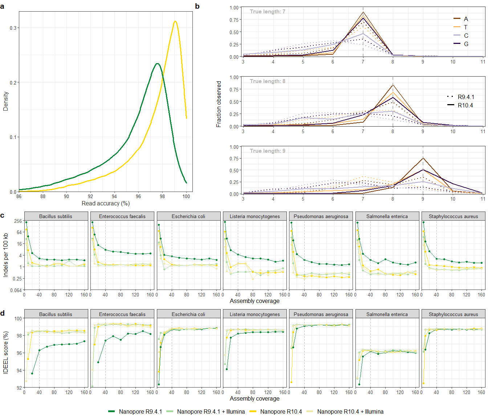

Plotting-zymo
================

### Description: R code for generating plots of Zymo Mock community sequencing data

### Load dependencies

``` r
library(ggplot2)
library(stringr)
library(ggpubr)
library(dplyr)
library(tidyverse)
```

### Load QUAST/ANI/IDEEL dataframes

``` r
quast_r941=read.delim("quast/quast_r941.tsv", sep="\t", header=T)
quast_r941_il=read.delim("quast/quast_r941-il.tsv", sep="\t", header=T)

quast_r104=read.delim("quast/quast_r104.tsv", sep="\t", header=T)
quast_r104_il=read.delim("quast/quast_r104-il.tsv", sep="\t", header=T)

ani_r941=read.delim("fastani/fastani_r941.txt", sep="\t", header=F)
ani_r941_il=read.delim("fastani/fastani_r941-il.txt", sep="\t", header=F)

ani_r104=read.delim("fastani/fastani_r104.txt", sep="\t", header=F)
ani_r104_il=read.delim("fastani/fastani_r104-il.txt", sep="\t", header=F)

ideel_r941=read.delim("ideel/ideel_r941.tsv", sep="\t", header=F)
ideel_r941_il=read.delim("ideel/ideel_r941-il.tsv", sep="\t", header=F)

ideel_r104=read.delim("ideel/ideel_r104.tsv", sep="\t", header=F)
ideel_r104_il=read.delim("ideel/ideel_r104-il.tsv", sep="\t", header=F)

ideel_ref=read.delim("ideel/ideel_zymo.tsv", sep="\t", header=F)
```

### Wrangle ANI data

``` r
wrangle_ani <- function(df) {
  
df$V1 <- gsub('.fasta','', df$V1, fixed = TRUE)
df$V1 <- substring(df$V1,3)
df=df[,c(1,3)]
colnames(df) <- c("assembly","ANI")

return(df)}

ani_r941  <- wrangle_ani(ani_r941)
ani_r941_il  <- wrangle_ani(ani_r941_il)
ani_r104  <- wrangle_ani(ani_r104)
ani_r104_il  <- wrangle_ani(ani_r104_il)
```

### Wrangle QUAST data

``` r
wrangle_quast <- function(df) {
  
df=df[,c(1,14,16:20,34:39)]
colnames(df) <- c("assembly","contigs","assembly_len_bp","ref_len_bp","GC_assembly","GC_ref","N50",
                      "unalligned_bp","genome_frac","dup_ratio","Ns_per_100kb","MMs_per_100kb","Indels_per_100kb")

return(df)}

quast_r941  <- wrangle_quast(quast_r941)
quast_r941_il  <- wrangle_quast(quast_r941_il)
quast_r104  <- wrangle_quast(quast_r104)
quast_r104_il  <- wrangle_quast(quast_r104_il)
```

### Wrangle IDEEL data

``` r
wrangle_ideel<- function(df) {
  
colnames(df) <- c("datatype", "subject_id","query_len","subject_len","aligned_len","query_start","query_end",
                  "subject_start","subject_end","e_value","bit_score", "percent_identity", "N_identical",
                  "N_mismatch", "N_postive", "N_gaps")
df$datatype <- gsub('asm/ideel/','', df$datatype, fixed = TRUE)
df$datatype <- gsub('_prot.tsv','', df$datatype, fixed = TRUE)
df$datatype <- gsub(' contig_[_0-9]+','', df$datatype, fixed = FALSE)
df$ratio <- df$query_len/df$subject_len
df$status <- ifelse((df$ratio >= 0.95), 1, 0)
df_count_all <- aggregate(df$status, by=list(Category=df$datatype), FUN=length)
df_count_full <- aggregate(df$status, by=list(Category=df$datatype), FUN=sum)
df_count <- merge(df_count_all,df_count_full,by="Category")
colnames(df_count) <- c("assembly","proteins_all","proteins_full")
df_count$proteins_full_frac <- df_count$proteins_full/df_count$proteins_all

return(df_count)}

# Take data for overlapping queries
ideel_r941_ <- ideel_r941[(ideel_r941$V2 %in% ideel_r941_il$V2),]
ideel_r941_ <- ideel_r941[(ideel_r941$V2 %in% ideel_r104$V2),]
ideel_r941_ <- ideel_r941[(ideel_r941$V2 %in% ideel_r104_il$V2),]

ideel_r941__ <- ideel_r941_

ideel_r941_il_ <- ideel_r941_il[(ideel_r941_il$V2 %in% ideel_r941_$V2),]
ideel_r104_ <- ideel_r104[(ideel_r104$V2 %in% ideel_r941_$V2),]
ideel_r104_il_ <- ideel_r104_il[(ideel_r104_il$V2 %in% ideel_r941_$V2),]

ideel_r941_  <- wrangle_ideel(ideel_r941_)
ideel_r941_il_  <- wrangle_ideel(ideel_r941_il_)
ideel_r104_  <- wrangle_ideel(ideel_r104_)
ideel_r104_il_  <- wrangle_ideel(ideel_r104_il_)
```

### Wrangle IDEEL data for reference genomes

``` r
ideel_ref_ <- ideel_ref
ideel_ref_ <- ideel_ref_[(ideel_ref_$V3 %in% ideel_r941__$V2),]

colnames(ideel_ref_) <- c("datatype", "prot_id", "subject_id","query_len","subject_len","aligned_len","query_start","query_end",
                  "subject_start","subject_end","e_value","bit_score", "percent_identity", "N_identical", "N_mismatch", "N_postive", "N_gaps")

ideel_ref_$datatype <- gsub('.tsv','', ideel_ref_$datatype, fixed = TRUE)
ideel_ref_$ratio <- ideel_ref_$query_len/ideel_ref_$subject_len
ideel_ref_$status <- ifelse((ideel_ref_$ratio >= 0.95), 1, 0)

ideel_ref_all <- aggregate(ideel_ref_$status, by=list(Category=ideel_ref_$datatype), FUN=length)
ideel_ref_full <- aggregate(ideel_ref_$status, by=list(Category=ideel_ref_$datatype), FUN=sum)

ideel_ref_count <- merge(ideel_ref_all,ideel_ref_full,by="Category")
colnames(ideel_ref_count) <- c("species","proteins_all","proteins_full")
ideel_ref_count$proteins_full_frac <- ideel_ref_count$proteins_full/ideel_ref_count$proteins_all

ideel_ref_count$species <- gsub('_',' ', ideel_ref_count$species, fixed = TRUE)
```

### Merge ANI/QUAST/IDEEL data

``` r
r941 <- merge(quast_r941,ani_r941,by="assembly")
r941 <- merge(r941,ideel_r941_,by="assembly")
r941$type <- "Nanopore R9.4.1"

r941_il <- merge(quast_r941_il,ani_r941_il,by="assembly")
r941_il <- merge(r941_il,ideel_r941_il_,by="assembly")
r941_il$type <- "Nanopore R9.4.1 + Illumina"

r104 <- merge(quast_r104,ani_r104,by="assembly")
r104 <- merge(r104,ideel_r104_,by="assembly")
r104$type <- "Nanopore R10.4"

r104_il <- merge(quast_r104_il,ani_r104_il,by="assembly")
r104_il <- merge(r104_il,ideel_r104_il_,by="assembly")
r104_il$type <- "Nanopore R10.4 + Illumina"

df<-rbind(r941,r941_il,r104,r104_il)

df=cbind(df, data.frame(do.call('rbind',strsplit(as.character(df$assembly), "_",fixed=TRUE))))
colnames(df)[which(names(df) == "X3")] <- "cov"
df$species <- paste(df$X1,df$X2,sep=" ")

df$cov <- as.numeric(as.character(df$cov))
df$ANI <- as.numeric(as.character(df$ANI))
df$ANI_Q <- -10*log10(1-df$ANI*0.01)
```

### Indel plot

``` r
plot_indel <- ggplot(data=df, aes(x=cov, y=Indels_per_100kb, color=type)) + 
  geom_line() + geom_point(size=1.4) +
  scale_color_manual(values = c("Nanopore R9.4.1"="#008837", "Nanopore R9.4.1 + Illumina"="#a6dba0",
                               "Nanopore R10.4"="#ffd700", "Nanopore R10.4 + Illumina"="#eee8aa")) +
  scale_y_continuous(breaks=c(0.064,0.25,1,4,16,64,256), labels = c(0.064,0.25,1,4,16,64,256),
                     limits = c(0.064,256), expand = c(0,0),trans = "log2") +
  scale_x_continuous(breaks=c(0,40,80,120,160), limits = c(0,170), expand = c(0,0)) + theme_bw() +
  labs(col="", x="Assembly coverage", y="Indels per 100 kb") +
  theme(legend.position = "bottom", legend.text=element_text(size=12), legend.box.just = "center",
        axis.title.y = element_text(size = 12), axis.text.x = element_text(size = 10), strip.text = element_text(size=10),
        axis.text.y = element_text(size = 10), legend.title = element_text(size=14),
        axis.title.x = element_text(size = 12), legend.box = "horizontal") +
  guides(color = guide_legend(nrow = 1, byrow=FALSE, override.aes = list(size =2, shape = NA))) + facet_grid(. ~ species)

plot_indel 
```

<!-- -->

### Mismatch plot

``` r
plot_mm <- ggplot(data=df, aes(x=cov, y=MMs_per_100kb, color=type)) + 
  geom_line() + geom_point(size=1.4) +
  scale_color_manual(values = c("Nanopore R9.4.1"="#008837", "Nanopore R9.4.1 + Illumina"="#a6dba0",
                               "Nanopore R10.4"="#ffd700", "Nanopore R10.4 + Illumina"="#eee8aa")) +
  scale_y_continuous(breaks=c(0.064,0.25,1,4,16,64,256),labels = c(0.064,0.25,1,4,16,64,256),
                     limits = c(0.064,256), expand = c(0,0),trans = "log2") +
  scale_x_continuous(breaks=c(0,40,80,120,160), limits = c(0,170), expand = c(0,0)) + theme_bw() +
  labs(col="", x="Assembly coverage", y="Mismatches per 100 kb") +
  theme(legend.position = "bottom", legend.text=element_text(size=14), legend.box.just = "center",
        axis.title.y = element_text(size = 12), axis.text.x = element_text(size = 10), strip.text = element_text(size=10),
        axis.text.y = element_text(size = 10), legend.title = element_text(size=14),
        axis.title.x = element_text(size = 12), legend.box = "horizontal") + guides(color = guide_legend(nrow = 1, byrow=FALSE, override.aes = list(size = 2, shape = NA))) +
  facet_grid(. ~ species)

plot_mm
```

<!-- -->

# ANI plot

``` r
plot_ani <- ggplot(data=df, aes(x=cov, y=ANI_Q, color=type)) + 
  geom_line() + geom_point(size=1.4) +
  scale_color_manual(values = c("Nanopore R9.4.1"="#008837", "Nanopore R9.4.1 + Illumina"="#a6dba0",
                               "Nanopore R10.4"="#ffd700", "Nanopore R10.4 + Illumina"="#eee8aa")) +
  scale_y_continuous(breaks=c(20,30,40,50),labels = c(99,99.9,99.99,99.999), limits = c(20,55), expand = c(0,0)) +
  scale_x_continuous(breaks=c(0,40,80,120,160), limits = c(0,170), expand = c(0,0)) + theme_bw() +
  labs(col="", x="Assembly coverage", y="ANI (%)") +
  theme(legend.position = "bottom", legend.text=element_text(size=14), legend.box.just = "center",
        axis.title.y = element_text(size = 12), axis.text.x = element_text(size = 10), strip.text = element_text(size=10),
        axis.text.y = element_text(size = 10), legend.title = element_text(size=14),
        axis.title.x = element_text(size = 12), legend.box = "horizontal") + guides(color = guide_legend(nrow = 1, byrow=FALSE, override.aes = list(size = 2, shape = NA))) +
  facet_grid(. ~ species)

plot_ani
```

<!-- -->

### IDEEL score plot

``` r
plot_ideel <- ggplot(data=df, aes(x=cov, y=proteins_full_frac*100, color=type)) + 
  geom_line() + geom_point(size=1.4) +
  scale_color_manual(values = c("Nanopore R9.4.1"="#008837", "Nanopore R9.4.1 + Illumina"="#a6dba0",
                               "Nanopore R10.4"="#ffd700", "Nanopore R10.4 + Illumina"="#eee8aa")) +
  scale_y_continuous(limits = c(92,100), expand = c(0,0)) +
  scale_x_continuous(breaks=c(0,40,80,120,160), limits = c(0,170), expand = c(0,0)) + theme_bw() +
  labs(col="", x="Assembly coverage", y="IDEEL score (%)") +
  theme(legend.position = "bottom", legend.text=element_text(size=14), legend.box.just = "center",
        axis.title.y = element_text(size = 12), axis.text.x = element_text(size = 10), strip.text = element_text(size=10),
        axis.text.y = element_text(size = 10), legend.title = element_text(size=14),
        axis.title.x = element_text(size = 12), legend.box = "horizontal") + geom_hline(data = ideel_ref_count, aes(yintercept = proteins_full_frac*100), size=0.6, lty=2, color="grey70", alpha=0.8) +  scale_linetype_manual(values = c(1, 1, 2, 2)) + 
  guides(color = guide_legend(nrow = 1, byrow=FALSE, override.aes = list(size = 2, shape = NA))) + facet_grid(. ~ species)

plot_ideel
```

<!-- -->

### Merged ANI-QUAST-IDEEL plot

``` r
plot_merged <- ggarrange(plot_ani, plot_mm, plot_indel, plot_ideel, nrow=4, ncol=1, align = c("v"), legend = "bottom", common.legend = TRUE)

plot_merged
```

<!-- -->

### Load NanoPlot data for read mappings to reference sequences. Reads were subsetted to 100k.

``` r
reads_ilmn=read.delim("nanoplot/ilmn_100k.tsv", sep="\t", header=F)
reads_ilmn$type = "Illumina"

reads_r941=read.delim("nanoplot/r941_100k.tsv", sep="\t", header=F)
reads_r941$type = "Nanopore R9.4.1"

reads_r104=read.delim("nanoplot/r104_100k.tsv", sep="\t", header=F)
reads_r104$type = "Nanopore R10.4"

reads = rbind(reads_r941,reads_r104)
colnames(reads) <- c("readIDs", "quals", "aligned_quals","lengths", "aligned_lengths" ,"mapQ", "percentIdentity", "type")
```

### Check observed and estimated read accuracies

``` r
estimate_mode <- function(x) {
  d <- density(x)
  d$x[which.max(d$y)] }

message("Estimated:")
```

    ## Estimated:

``` r
message("ILMN: ",round((1-10**(-estimate_mode(reads_ilmn$V1)/10))*100,2), " %")
```

    ## ILMN: 99.99 %

``` r
message("R941: ",round((1-10**(-estimate_mode(reads_r941$V2)/10))*100,2), " %")
```

    ## R941: 96.89 %

``` r
message("R104: ",round((1-10**(-estimate_mode(reads_r104$V2)/10))*100,2), " %")
```

    ## R104: 98.22 %

``` r
message("Observed")
```

    ## Observed

``` r
message("ILMN: ",round(estimate_mode(reads_ilmn$V6),2), " %")
```

    ## ILMN: 99.98 %

``` r
message("R941: ",round(estimate_mode(reads_r941$V7),2), " %")
```

    ## R941: 97.59 %

``` r
message("R104: ",round(estimate_mode(reads_r104$V7),2), " %")
```

    ## R104: 99.07 %

### Observed read accuracy plot

``` r
plot_accur <- ggplot()  +
  geom_density(data=reads, aes(x=percentIdentity, count=percentIdentity, color=type), size=1.4) +
  scale_x_continuous(expand = c(0, 0), limits= c(85,100), breaks = c(86,88,90,92,94,96,98,100)) + 
  scale_y_continuous(expand = c(0, 0), limits=c(0,0.33),  breaks = c(0.00,0.1,0.2, 0.3)) +
  coord_cartesian(xlim=c(86,100.5)) +
  labs(title="", y="Density", x="Read accuracy (%)") + theme_bw() +
  scale_color_manual(name = "Chemistry:", values = c("Nanopore R9.4.1"="#008837","Nanopore R10.4"="#ffd700")) + 
     theme(legend.position = "none", legend.direction = "horizontal",
        axis.text.x = element_text(color = "grey20", size = 10),
        axis.text.y = element_text(color = "grey20", size = 10),  
        axis.title.x = element_text(color = "grey20", size = 12),
        axis.title.y = element_text(color = "grey20", size = 12),
        legend.title = element_text(size = 12),
        legend.text = element_text(size = 12),
        plot.title = element_text(size=12), strip.text = element_text(size=10))  

plot_accur
```

<!-- -->

### Load Counterr data for read mappings

``` r
hp_r9=read.table("counterr/counterr_r9.csv", sep=",", header=F) 
hp_r104=read.table("counterr/counterr_r104.csv", sep=",", header=F) 
```

### Wrangle Counterr data

``` r
abund <- function(df,sample,mode) {
  
df_nuc1 <- as.data.frame(matrix(df[1,], nrow=12, ncol=12))
df_nuc2 <- as.data.frame(matrix(df[2,], nrow=12, ncol=12))
df_nuc3 <- as.data.frame(matrix(df[3,], nrow=12, ncol=12))
df_nuc4 <- as.data.frame(matrix(df[4,], nrow=12, ncol=12))

df_nuc1$length <- seq.int(nrow(df_nuc1))-1
df_nuc1 <- mutate_all(df_nuc1, function(x) as.numeric(as.character(x)))
df_nuc1$id <- "A"

df_nuc2$length <- seq.int(nrow(df_nuc2))-1
df_nuc2 <- mutate_all(df_nuc2, function(x) as.numeric(as.character(x)))
df_nuc2$id <- "C"

df_nuc3$length <- seq.int(nrow(df_nuc3))-1
df_nuc3 <- mutate_all(df_nuc3, function(x) as.numeric(as.character(x)))
df_nuc3$id <- "G"

df_nuc4$length <- seq.int(nrow(df_nuc4))-1
df_nuc4 <- mutate_all(df_nuc4, function(x) as.numeric(as.character(x)))
df_nuc4$id <- "T"

if (mode == "frac") {
for (i in 6:12) {
  df_nuc1[,i] <- round(df_nuc1[,i]/sum(df_nuc1[,i]),6)
  df_nuc2[,i] <- round(df_nuc2[,i]/sum(df_nuc2[,i]),6)
  df_nuc3[,i] <- round(df_nuc3[,i]/sum(df_nuc3[,i]),6)
  df_nuc4[,i] <- round(df_nuc4[,i]/sum(df_nuc4[,i]),6)}}

df_hp <- rbind(df_nuc1,df_nuc2,df_nuc3,df_nuc4)
df_hp$datatype <- sample

return(df_hp)}

hp_r9_   <- abund(hp_r9,"Nanopore R9","count")
hp_r104_   <- abund(hp_r104,"Nanopore R10.4","count")


hp_ <- rbind(hp_r9_,hp_r104_)
hp_$id <- factor(hp_$id, levels = c("A","T","G","C"))
hp_$datatype <- factor(hp_$datatype, levels = c("Nanopore R9","Nanopore R10.4"))


hp_r9  <- abund(hp_r9,"Nanopore R9","frac")
hp_r104  <- abund(hp_r104,"Nanopore R10.4","frac")


hp <- rbind(hp_r9,hp_r104)
hp$id <- factor(hp$id, levels = c("A","T","G","C"))
hp$datatype <- factor(hp$datatype, levels = c("Nanopore R9","Nanopore R10.4"))
```

### Summarise Counterr observations

``` r
hp_5 <- hp_ %>% select(V6,length, id, datatype)
hp_5_ <- hp_5[(hp_5$length == 5), ]
colnames(hp_5_) <- c("sum_corr","length","id","datatype")
hp_5 <- aggregate(hp_5$V6, by=list(hp_5$id,hp_5$datatype), FUN=sum)
colnames(hp_5) <- c("id","datatype","sum")
hp_5 <- merge(hp_5,hp_5_, by=c("id","datatype"))

hp_6 <- hp_ %>% select(V7,length, id, datatype)
hp_6_ <- hp_6[(hp_6$length == 6), ]
colnames(hp_6_) <- c("sum_corr","length","id","datatype")
hp_6 <- aggregate(hp_6$V7, by=list(hp_6$id,hp_6$datatype), FUN=sum)
colnames(hp_6) <- c("id","datatype","sum")
hp_6 <- merge(hp_6,hp_6_, by=c("id","datatype"))

hp_7 <- hp_ %>% select(V8,length, id, datatype)
hp_7_ <- hp_7[(hp_7$length == 7), ]
colnames(hp_7_) <- c("sum_corr","length","id","datatype")
hp_7 <- aggregate(hp_7$V8, by=list(hp_7$id,hp_7$datatype), FUN=sum)
colnames(hp_7) <- c("id","datatype","sum")
hp_7 <- merge(hp_7,hp_7_, by=c("id","datatype"))

hp_8 <- hp_ %>% select(V9,length, id, datatype)
hp_8_ <- hp_8[(hp_8$length == 8), ]
colnames(hp_8_) <- c("sum_corr","length","id","datatype")
hp_8 <- aggregate(hp_8$V9, by=list(hp_8$id,hp_8$datatype), FUN=sum)
colnames(hp_8) <- c("id","datatype","sum")
hp_8 <- merge(hp_8,hp_8_, by=c("id","datatype"))

hp_9 <- hp_ %>% select(V10,length, id, datatype)
hp_9_ <- hp_9[(hp_9$length == 9), ]
colnames(hp_9_) <- c("sum_corr","length","id","datatype")
hp_9 <- aggregate(hp_9$V10, by=list(hp_9$id,hp_9$datatype), FUN=sum)
colnames(hp_9) <- c("id","datatype","sum")
hp_9 <- merge(hp_9,hp_9_, by=c("id","datatype"))

hp_10 <- hp_ %>% select(V11,length, id, datatype)
hp_10_ <- hp_10[(hp_10$length == 10), ]
colnames(hp_10_) <- c("sum_corr","length","id","datatype")
hp_10 <- aggregate(hp_10$V11, by=list(hp_10$id,hp_10$datatype), FUN=sum)
colnames(hp_10) <- c("id","datatype","sum")
hp_10 <- merge(hp_10,hp_10_, by=c("id","datatype"))


hp_gen <- rbind(hp_5,hp_6,hp_7,hp_8,hp_9,hp_10)

hp_gen_ <- hp_gen %>% select(length, sum, id, datatype) %>% pivot_wider(names_from = id, values_from = sum, values_fill = 0)
hp_gen_ <- hp_gen_[ , c("length","datatype","A","T","C","G")]

hp_gen$datatype <- factor(hp_gen$datatype, levels = c("Nanopore R9","Nanopore R10.4"))

hp_gen$fraction_corr <- round(hp_gen$sum_corr/hp_gen$sum*100,3)
```

### Homopolymer plot: 7-9, merged

``` r
hp_plot <- hp
hp_plot$datatype  <- gsub('Nanopore R9', "Nanopore R9.4.1", hp_plot$datatype)
hp_plot$datatype  <- gsub('Nanopore R9.4.1', "R9.4.1", hp_plot$datatype)
hp_plot$datatype  <- gsub('Nanopore R10.4', "R10.4", hp_plot$datatype)

hp_plot$datatype <- factor(hp_plot$datatype, levels = c("R9.4.1","R10.4"))
hp_plot$id<- factor(hp_plot$id, levels = c("A","T","G","C"))


plot_hp7 <- ggplot(data=hp_plot, aes(x=length, y=V8, color=id, linetype=datatype)) + 
  geom_line(size=1) + scale_x_continuous(breaks=c(1,2,3,4,5,6,7,8,9,10,11), limits = c(3,11), expand = c(0.01, 0))  +
  scale_y_continuous(expand = c(0.01, 0), breaks=c(0.0,0.25,0.5,0.75,1), limits = c(0,1))+ theme_bw() + coord_cartesian(clip = 'off') +
  labs(title="", y="", x="", color="", linetype="") + guides(shape = FALSE) +
   geom_vline(xintercept=7, lty=2, color="gray70", size=0.8) +  scale_linetype_manual(values=c("R9.4.1"="dotted", "R10.4"="solid")) +
  theme(legend.position = c(0.9, 0.6),legend.text=element_text(size=12), axis.title.y = element_text(size = 12),
  axis.title.x = element_text(size = 12), axis.text.x = element_text(size = 10), axis.text.y = element_text(size = 10), strip.text = element_text(size=10),
  legend.title = element_text(size=12), legend.background=element_blank()) + scale_color_manual(values = c("A"="#7f3b08","T"="#fdb863","C"="#b2abd2","G"="#2d004b")) + 
  guides(linetype = FALSE, color=guide_legend(override.aes=list(size=1.2, fill=NA)))  +
         annotate(geom = "text", x = 3.2, y = 0.92, size=4, color = "grey70", hjust = 0, fontface=2,
            label = "True length: 7")

plot_hp7 <- plot_hp7 + theme(plot.margin=unit(c(-0.05,0,-0.04,0), "null"))


plot_hp8 <- ggplot(data=hp_plot, aes(x=length, y=V9, color=id, linetype=datatype)) + 
  geom_line(size=1) + scale_x_continuous(breaks=c(1,2,3,4,5,6,7,8,9,10,11), limits = c(3,11), expand = c(0.01, 0))  +
  scale_y_continuous(expand = c(0.01, 0), breaks=c(0.0,0.25,0.5,0.75,1), limits = c(0,1))+ theme_bw() + coord_cartesian(clip = 'off') +
  labs(title="", y="", x="", color="Nucleotide:", linetype="") + guides(shape = FALSE) +
   geom_vline(xintercept=8, lty=2, color="gray70", size=0.8) +  scale_linetype_manual(values=c("R9.4.1"="dotted", "R10.4"="solid")) +
  theme(legend.position = c(0.9, 0.6),legend.text=element_text(size=12), axis.title.y = element_text(size = 12),
  axis.title.x = element_text(size = 12), axis.text.x = element_text(size = 10), axis.text.y = element_text(size = 10), strip.text = element_text(size=10),
  legend.title = element_text(size=12), legend.background=element_blank()) + scale_color_manual(values = c("A"="#7f3b08","T"="#fdb863","C"="#b2abd2","G"="#2d004b"))  + 
  guides(colour=FALSE, linetype=guide_legend(override.aes=list(size=1.2, fill=NA))) +  annotate(geom = "text", x = 3.2, y = 0.92, size=4, color = "grey70", hjust = 0, fontface=2,
            label = "True length: 8")

plot_hp8 <- plot_hp8 + theme(plot.margin=unit(c(-0.05,0,-0.04,0), "null"))


plot_hp9 <- ggplot(data=hp_plot, aes(x=length, y=V10, color=id, linetype=datatype)) + 
  geom_line(size=1) + scale_x_continuous(breaks=c(1,2,3,4,5,6,7,8,9,10,11), limits = c(3,11), expand = c(0.01, 0))  +
  scale_y_continuous(expand = c(0.01, 0), breaks=c(0.0,0.25,0.5,0.75,1), limits = c(0,1))+ theme_bw() + coord_cartesian(clip = 'off') +
  labs(title="", y="", x="Observed homopolymer length", color="", linetype="") + guides(shape = FALSE) +
   geom_vline(xintercept=9, lty=2, color="gray70", size=0.8) +  scale_linetype_manual(values=c("R9.4.1"="dotted", "R10.4"="solid")) +
  theme(legend.position = "none",legend.text=element_text(size=12), axis.title.y = element_text(size = 12),
  axis.title.x = element_text(size = 12), axis.text.x = element_text(size = 10), axis.text.y = element_text(size = 10), strip.text = element_text(size=10),
  legend.title = element_text(size=12)) + scale_color_manual(values = c("A"="#7f3b08","T"="#fdb863","C"="#b2abd2","G"="#2d004b")) +
       annotate(geom = "text", x = 3.2, y = 0.92, size=4, color = "grey70", hjust = 0, fontface=2,
            label = "True length: 9")

plot_hp9 <- plot_hp9 + theme(plot.margin=unit(c(-0.05,0,0,0), "null"))


plot_hp_merged <- ggarrange(plot_hp7, plot_hp8, plot_hp9, nrow=3, ncol=1, align = c("v"), common.legend = FALSE)
plot_hp_merged <- annotate_figure(plot_hp_merged, left = text_grob("Fraction observed", size = 12, , rot = 90))
plot_hp_merged <- plot_hp_merged + theme(plot.margin=unit(c(0,0,0,-0.0055), "null"))

plot_hp_merged
```

<!-- -->

### Combined figure for read accuracy, homopolymers, indels and IDEEL scores

``` r
plot_fig1_a <- ggarrange(plot_accur, plot_hp_merged , ncol=2, nrow=1, widths=c(1,1.5),  
                         labels = c("a", "b"), font.label = list(size = 16), align = c("v"), hjust=0.01)

plot_fig1_b <- ggarrange(plot_indel,plot_ideel, ncol=1, nrow=2, widths=c(1,1),  common.legend = TRUE, legend = "bottom", labels = c("c", "d"),
                         font.label = list(size = 16), align = c("v"), hjust=0.01)

plot_fig1 <- ggarrange(plot_fig1_a, plot_fig1_b, nrow=2, align = c("v"), widths=c(1,1.2))
plot_fig1
```

<!-- -->

### Homopolymer plot: R9.4.1, 5-10

``` r
hp_plot <- hp
hp_plot$datatype  <- gsub('Nanopore R9', "Nanopore R9.4.1", hp_plot$datatype)
hp_plot$id<- factor(hp_plot$id, levels = c("A","T","G","C"))
hp_plot$datatype <- factor(hp_plot$datatype, levels = c("Nanopore R9.4.1", "Nanopore R10.4"))

hp_plot_R9 <- hp_plot[(hp_plot$datatype == "Nanopore R9.4.1"), ]
hp_gen_R9 <- hp_gen[(hp_gen$datatype == "Nanopore R9"), ]


plot_hp_5 <- ggplot(data=hp_plot_R9, aes(x=length, y=V6, color=id)) + 
  geom_line(size=0.75) + 
  scale_x_continuous(breaks=c(1,2,3,4,5,6,7,8,9,10,11), expand = c(0.01, 0), limits = c(2,12))  +
  scale_y_continuous(expand = c(0.01, 0), breaks=c(0.0,0.25,0.5,0.75,1), limits = c(0,1))+ theme_bw() + 
  coord_cartesian(clip = 'on', xlim = c(2.5,11.5)) +
  labs(title="", y="", x="", color="", linetype="") + guides(shape = FALSE) +
   geom_vline(xintercept=5, lty=2, color="gray70", size=0.8) +  
  theme(legend.position = "none",legend.text=element_text(size=12), axis.title.y = element_text(size = 12),
  axis.title.x = element_text(size = 12), axis.text.x = element_text(size = 10), axis.text.y = element_text(size = 10), strip.text = element_text(size=10), 
  legend.title = element_text(size=12), legend.background=element_blank()) + 
  scale_color_manual(values = c("A"="#7f3b08","T"="#fdb863","C"="#b2abd2","G"="#2d004b")) +
   annotate(geom = "text", x = 10.1, y = 0.95, size=4, color = "#7f3b08", hjust = 0, fontface=2,
            label = paste("A: ",hp_gen_R9[(hp_gen_R9$id == "A" & hp_gen_R9$length == 5), ]$sum)) +
     annotate(geom = "text", x = 10.1, y = 0.88, size=4, color = "#fdb863", hjust = 0, fontface=2,
            label = paste("T: ",hp_gen_R9[(hp_gen_R9$id == "T" & hp_gen_R9$length == 5), ]$sum)) +
     annotate(geom = "text", x = 10.1, y = 0.81, size=4, color = "#2d004b", hjust = 0, fontface=2,
            label = paste("G: ",hp_gen_R9[(hp_gen_R9$id == "G" & hp_gen_R9$length == 5), ]$sum)) +
     annotate(geom = "text", x = 10.1, y = 0.74, size=4, color = "#b2abd2", hjust = 0, fontface=2,
            label = paste("C: ",hp_gen_R9[(hp_gen_R9$id == "C" & hp_gen_R9$length == 5), ]$sum)) +
       annotate(geom = "text", x = 2.6, y = 0.95, size=4, color = "grey70", hjust = 0, fontface=2,
            label = "True length: 5")


plot_hp_6 <- ggplot(data=hp_plot_R9, aes(x=length, y=V7, color=id)) + 
  geom_line(size=0.75) + 
  scale_x_continuous(breaks=c(1,2,3,4,5,6,7,8,9,10,11), expand = c(0.01, 0), limits = c(2,12))  +
  scale_y_continuous(expand = c(0.01, 0), breaks=c(0.0,0.25,0.5,0.75,1), limits = c(0,1))+ theme_bw() + 
  coord_cartesian(clip = 'on', xlim = c(2.5,11.5)) +
  labs(title="", y="", x="", color="", linetype="") + guides(shape = FALSE) +
   geom_vline(xintercept=6, lty=2, color="gray70", size=0.8) +  
  theme(legend.position = "none",legend.text=element_text(size=12), axis.title.y = element_text(size = 12),
  axis.title.x = element_text(size = 12), axis.text.x = element_text(size = 10), axis.text.y = element_text(size = 10), strip.text = element_text(size=10), 
  legend.title = element_text(size=12), legend.background=element_blank()) + 
  scale_color_manual(values = c("A"="#7f3b08","T"="#fdb863","C"="#b2abd2","G"="#2d004b")) +
   annotate(geom = "text", x = 10.1, y = 0.95, size=4, color = "#7f3b08", hjust = 0, fontface=2,
            label = paste("A: ",hp_gen_R9[(hp_gen_R9$id == "A" & hp_gen_R9$length == 6), ]$sum)) +
     annotate(geom = "text", x = 10.1, y = 0.88, size=4, color = "#fdb863", hjust = 0, fontface=2,
            label = paste("T: ",hp_gen_R9[(hp_gen_R9$id == "T" & hp_gen_R9$length == 6), ]$sum)) +
     annotate(geom = "text", x = 10.1, y = 0.81, size=4, color = "#2d004b", hjust = 0, fontface=2,
            label = paste("G: ",hp_gen_R9[(hp_gen_R9$id == "G" & hp_gen_R9$length == 6), ]$sum)) +
     annotate(geom = "text", x = 10.1, y = 0.74, size=4, color = "#b2abd2", hjust = 0, fontface=2,
            label = paste("C: ",hp_gen_R9[(hp_gen_R9$id == "C" & hp_gen_R9$length == 6), ]$sum)) +
         annotate(geom = "text", x = 2.6, y = 0.95, size=4, color = "grey70", hjust = 0, fontface=2,
            label = "True length: 6")


plot_hp_7 <- ggplot(data=hp_plot_R9, aes(x=length, y=V8, color=id)) + 
  geom_line(size=0.75) + 
  scale_x_continuous(breaks=c(1,2,3,4,5,6,7,8,9,10,11), expand = c(0.01, 0), limits = c(2,12))  +
  scale_y_continuous(expand = c(0.01, 0), breaks=c(0.0,0.25,0.5,0.75,1), limits = c(0,1))+ theme_bw() + 
  coord_cartesian(clip = 'on', xlim = c(2.5,11.5)) +
  labs(title="", y="", x="", color="", linetype="") + guides(shape = FALSE) +
   geom_vline(xintercept=7, lty=2, color="gray70", size=0.8) +  
  theme(legend.position = "none",legend.text=element_text(size=12), axis.title.y = element_text(size = 12),
  axis.title.x = element_text(size = 12), axis.text.x = element_text(size = 10), axis.text.y = element_text(size = 10), strip.text = element_text(size=10), 
  legend.title = element_text(size=12), legend.background=element_blank()) + 
  scale_color_manual(values = c("A"="#7f3b08","T"="#fdb863","C"="#b2abd2","G"="#2d004b")) +
   annotate(geom = "text", x = 10.1, y = 0.95, size=4, color = "#7f3b08", hjust = 0, fontface=2,
            label = paste("A: ",hp_gen_R9[(hp_gen_R9$id == "A" & hp_gen_R9$length == 7), ]$sum)) +
     annotate(geom = "text", x = 10.1, y = 0.88, size=4, color = "#fdb863", hjust = 0, fontface=2,
            label = paste("T: ",hp_gen_R9[(hp_gen_R9$id == "T" & hp_gen_R9$length == 7), ]$sum)) +
     annotate(geom = "text", x = 10.1, y = 0.81, size=4, color = "#2d004b", hjust = 0, fontface=2,
            label = paste("G: ",hp_gen_R9[(hp_gen_R9$id == "G" & hp_gen_R9$length == 7), ]$sum)) +
     annotate(geom = "text", x = 10.1, y = 0.74, size=4, color = "#b2abd2", hjust = 0, fontface=2,
            label = paste("C: ",hp_gen_R9[(hp_gen_R9$id == "C" & hp_gen_R9$length == 7), ]$sum)) +
         annotate(geom = "text", x = 2.6, y = 0.95, size=4, color = "grey70", hjust = 0, fontface=2,
            label = "True length: 7")


plot_hp_8 <- ggplot(data=hp_plot_R9, aes(x=length, y=V9, color=id)) + 
  geom_line(size=0.75) + 
  scale_x_continuous(breaks=c(1,2,3,4,5,6,7,8,9,10,11), expand = c(0.01, 0), limits = c(2,12))  +
  scale_y_continuous(expand = c(0.01, 0), breaks=c(0.0,0.25,0.5,0.75,1), limits = c(0,1))+ theme_bw() + 
  coord_cartesian(clip = 'on', xlim = c(2.5,11.5)) +
  labs(title="", y="", x="", color="", linetype="") + guides(shape = FALSE) +
   geom_vline(xintercept=8, lty=2, color="gray70", size=0.8) +  
  theme(legend.position = "none",legend.text=element_text(size=12), axis.title.y = element_text(size = 12),
  axis.title.x = element_text(size = 12), axis.text.x = element_text(size = 10), axis.text.y = element_text(size = 10), strip.text = element_text(size=10), 
  legend.title = element_text(size=12), legend.background=element_blank()) + 
  scale_color_manual(values = c("A"="#7f3b08","T"="#fdb863","C"="#b2abd2","G"="#2d004b")) +
   annotate(geom = "text", x = 10.1, y = 0.95, size=4, color = "#7f3b08", hjust = 0, fontface=2,
            label = paste("A: ",hp_gen_R9[(hp_gen_R9$id == "A" & hp_gen_R9$length == 8), ]$sum)) +
     annotate(geom = "text", x = 10.1, y = 0.88, size=4, color = "#fdb863", hjust = 0, fontface=2,
            label = paste("T: ",hp_gen_R9[(hp_gen_R9$id == "T" & hp_gen_R9$length == 8), ]$sum)) +
     annotate(geom = "text", x = 10.1, y = 0.81, size=4, color = "#2d004b", hjust = 0, fontface=2,
            label = paste("G: ",hp_gen_R9[(hp_gen_R9$id == "G" & hp_gen_R9$length == 8), ]$sum)) +
     annotate(geom = "text", x = 10.1, y = 0.74, size=4, color = "#b2abd2", hjust = 0, fontface=2,
            label = paste("C: ",hp_gen_R9[(hp_gen_R9$id == "C" & hp_gen_R9$length == 8), ]$sum)) +
         annotate(geom = "text", x = 2.6, y = 0.95, size=4, color = "grey70", hjust = 0, fontface=2,
            label = "True length: 8")


plot_hp_9 <- ggplot(data=hp_plot_R9, aes(x=length, y=V10, color=id)) + 
  geom_line(size=0.75) + 
  scale_x_continuous(breaks=c(1,2,3,4,5,6,7,8,9,10,11), expand = c(0.01, 0), limits = c(2,12))  +
  scale_y_continuous(expand = c(0.01, 0), breaks=c(0.0,0.25,0.5,0.75,1), limits = c(0,1))+ theme_bw() + 
  coord_cartesian(clip = 'on', xlim = c(2.5,11.5)) +
  labs(title="", y="", x="", color="", linetype="") + guides(shape = FALSE) +
   geom_vline(xintercept=9, lty=2, color="gray70", size=0.8) +  
  theme(legend.position = "none",legend.text=element_text(size=12), axis.title.y = element_text(size = 12),
  axis.title.x = element_text(size = 12), axis.text.x = element_text(size = 10), axis.text.y = element_text(size = 10), strip.text = element_text(size=10), 
  legend.title = element_text(size=12), legend.background=element_blank()) + 
  scale_color_manual(values = c("A"="#7f3b08","T"="#fdb863","C"="#b2abd2","G"="#2d004b")) +
   annotate(geom = "text", x = 10.1, y = 0.95, size=4, color = "#7f3b08", hjust = 0, fontface=2,
            label = paste("A: ",hp_gen_R9[(hp_gen_R9$id == "A" & hp_gen_R9$length == 9), ]$sum)) +
     annotate(geom = "text", x = 10.1, y = 0.88, size=4, color = "#fdb863", hjust = 0, fontface=2,
            label = paste("T: ",hp_gen_R9[(hp_gen_R9$id == "T" & hp_gen_R9$length == 9), ]$sum)) +
     annotate(geom = "text", x = 10.1, y = 0.81, size=4, color = "#2d004b", hjust = 0, fontface=2,
            label = paste("G: ",hp_gen_R9[(hp_gen_R9$id == "G" & hp_gen_R9$length == 9), ]$sum)) +
     annotate(geom = "text", x = 10.1, y = 0.74, size=4, color = "#b2abd2", hjust = 0, fontface=2,
            label = paste("C: ",hp_gen_R9[(hp_gen_R9$id == "C" & hp_gen_R9$length == 9), ]$sum)) +
         annotate(geom = "text", x = 2.6, y = 0.95, size=4, color = "grey70", hjust = 0, fontface=2,
            label = "True length: 9")


plot_hp_10 <- ggplot(data=hp_plot_R9, aes(x=length, y=V11, color=id)) + 
  geom_line(size=0.75) + 
  scale_x_continuous(breaks=c(1,2,3,4,5,6,7,8,9,10,11), expand = c(0.01, 0), limits = c(2,12))  +
  scale_y_continuous(expand = c(0.01, 0), breaks=c(0.0,0.25,0.5,0.75,1), limits = c(0,1))+ theme_bw() + 
  coord_cartesian(clip = 'on', xlim = c(2.5,11.5)) +
  labs(title="", y="", x="", color="", linetype="") + guides(shape = FALSE) +
   geom_vline(xintercept=10, lty=2, color="gray70", size=0.8) +  
  theme(legend.position = "none",legend.text=element_text(size=12), axis.title.y = element_text(size = 12),
  axis.title.x = element_text(size = 12), axis.text.x = element_text(size = 10), axis.text.y = element_text(size = 10), strip.text = element_text(size=10), 
  legend.title = element_text(size=12), legend.background=element_blank()) + 
  scale_color_manual(values = c("A"="#7f3b08","T"="#fdb863","C"="#b2abd2","G"="#2d004b")) +
   annotate(geom = "text", x = 10.1, y = 0.95, size=4, color = "#7f3b08", hjust = 0, fontface=2,
            label = paste("A: ",hp_gen_R9[(hp_gen_R9$id == "A" & hp_gen_R9$length == 10), ]$sum_corr)) +
     annotate(geom = "text", x = 10.1, y = 0.88, size=4, color = "#fdb863", hjust = 0, fontface=2,
            label = paste("T: ",hp_gen_R9[(hp_gen_R9$id == "T" & hp_gen_R9$length == 10), ]$sum_corr)) +
     annotate(geom = "text", x = 10.1, y = 0.81, size=4, color = "#2d004b", hjust = 0, fontface=2,
            label = paste("G: ",hp_gen_R9[(hp_gen_R9$id == "G" & hp_gen_R9$length == 10), ]$sum_corr)) +
     annotate(geom = "text", x = 10.1, y = 0.74, size=4, color = "#b2abd2", hjust = 0, fontface=2,
            label = paste("C: ",hp_gen_R9[(hp_gen_R9$id == "C" & hp_gen_R9$length == 10), ]$sum_corr)) +
         annotate(geom = "text", x = 2.6, y = 0.95, size=4, color = "grey70", hjust = 0, fontface=2,
            label = "True length: 10")


plot_hp_merged <- ggarrange(plot_hp_5,plot_hp_6, plot_hp_7, plot_hp_8, plot_hp_9,plot_hp_10,
                            ncol=2, nrow = 3, align = c("h"), common.legend = FALSE)
plot_hp_merged
```

<!-- -->

### Homopolymer plot: R10.4, 5-10

``` r
hp_plot_R10 <- hp_plot[(hp_plot$datatype == "Nanopore R10.4"), ]
hp_gen_R10 <- hp_gen[(hp_gen$datatype == "Nanopore R10.4"), ]


plot_hp_5 <- ggplot(data=hp_plot_R10, aes(x=length, y=V6, color=id)) + 
  geom_line(size=0.75) + 
  scale_x_continuous(breaks=c(1,2,3,4,5,6,7,8,9,10,11), expand = c(0.01, 0), limits = c(2,12))  +
  scale_y_continuous(expand = c(0.01, 0), breaks=c(0.0,0.25,0.5,0.75,1), limits = c(0,1))+ theme_bw() + 
  coord_cartesian(clip = 'on', xlim = c(2.5,11.5)) +
  labs(title="", y="", x="", color="", linetype="") + guides(shape = FALSE) +
   geom_vline(xintercept=5, lty=2, color="gray70", size=0.8) +  
  theme(legend.position = "none",legend.text=element_text(size=12), axis.title.y = element_text(size = 12),
  axis.title.x = element_text(size = 12), axis.text.x = element_text(size = 10), axis.text.y = element_text(size = 10), strip.text = element_text(size=10), 
  legend.title = element_text(size=12), legend.background=element_blank()) + 
  scale_color_manual(values = c("A"="#7f3b08","T"="#fdb863","C"="#b2abd2","G"="#2d004b")) +
   annotate(geom = "text", x = 10.1, y = 0.95, size=4, color = "#7f3b08", hjust = 0, fontface=2,
            label = paste("A: ",hp_gen_R10[(hp_gen_R10$id == "A" & hp_gen_R10$length == 5), ]$sum)) +
     annotate(geom = "text", x = 10.1, y = 0.88, size=4, color = "#fdb863", hjust = 0, fontface=2,
            label = paste("T: ",hp_gen_R10[(hp_gen_R10$id == "T" & hp_gen_R10$length == 5), ]$sum)) +
     annotate(geom = "text", x = 10.1, y = 0.81, size=4, color = "#2d004b", hjust = 0, fontface=2,
            label = paste("G: ",hp_gen_R10[(hp_gen_R10$id == "G" & hp_gen_R10$length == 5), ]$sum)) +
     annotate(geom = "text", x = 10.1, y = 0.74, size=4, color = "#b2abd2", hjust = 0, fontface=2,
            label = paste("C: ",hp_gen_R10[(hp_gen_R10$id == "C" & hp_gen_R10$length == 5), ]$sum)) +
       annotate(geom = "text", x = 2.6, y = 0.95, size=4, color = "grey70", hjust = 0, fontface=2,
            label = "True length: 5")


plot_hp_6 <- ggplot(data=hp_plot_R10, aes(x=length, y=V7, color=id)) + 
  geom_line(size=0.75) + 
  scale_x_continuous(breaks=c(1,2,3,4,5,6,7,8,9,10,11), expand = c(0.01, 0), limits = c(2,12))  +
  scale_y_continuous(expand = c(0.01, 0), breaks=c(0.0,0.25,0.5,0.75,1), limits = c(0,1))+ theme_bw() + 
  coord_cartesian(clip = 'on', xlim = c(2.5,11.5)) +
  labs(title="", y="", x="", color="", linetype="") + guides(shape = FALSE) +
   geom_vline(xintercept=6, lty=2, color="gray70", size=0.8) +  
  theme(legend.position = "none",legend.text=element_text(size=12), axis.title.y = element_text(size = 12),
  axis.title.x = element_text(size = 12), axis.text.x = element_text(size = 10), axis.text.y = element_text(size = 10), strip.text = element_text(size=10), 
  legend.title = element_text(size=12), legend.background=element_blank()) + 
  scale_color_manual(values = c("A"="#7f3b08","T"="#fdb863","C"="#b2abd2","G"="#2d004b")) +
   annotate(geom = "text", x = 10.1, y = 0.95, size=4, color = "#7f3b08", hjust = 0, fontface=2,
            label = paste("A: ",hp_gen_R10[(hp_gen_R10$id == "A" & hp_gen_R10$length == 6), ]$sum)) +
     annotate(geom = "text", x = 10.1, y = 0.88, size=4, color = "#fdb863", hjust = 0, fontface=2,
            label = paste("T: ",hp_gen_R10[(hp_gen_R10$id == "T" & hp_gen_R10$length == 6), ]$sum)) +
     annotate(geom = "text", x = 10.1, y = 0.81, size=4, color = "#2d004b", hjust = 0, fontface=2,
            label = paste("G: ",hp_gen_R10[(hp_gen_R10$id == "G" & hp_gen_R10$length == 6), ]$sum)) +
     annotate(geom = "text", x = 10.1, y = 0.74, size=4, color = "#b2abd2", hjust = 0, fontface=2,
            label = paste("C: ",hp_gen_R10[(hp_gen_R10$id == "C" & hp_gen_R10$length == 6), ]$sum)) +
         annotate(geom = "text", x = 2.6, y = 0.95, size=4, color = "grey70", hjust = 0, fontface=2,
            label = "True length: 6")


plot_hp_7 <- ggplot(data=hp_plot_R10, aes(x=length, y=V8, color=id)) + 
  geom_line(size=0.75) + 
  scale_x_continuous(breaks=c(1,2,3,4,5,6,7,8,9,10,11), expand = c(0.01, 0), limits = c(2,12))  +
  scale_y_continuous(expand = c(0.01, 0), breaks=c(0.0,0.25,0.5,0.75,1), limits = c(0,1))+ theme_bw() + 
  coord_cartesian(clip = 'on', xlim = c(2.5,11.5)) +
  labs(title="", y="", x="", color="", linetype="") + guides(shape = FALSE) +
   geom_vline(xintercept=7, lty=2, color="gray70", size=0.8) +  
  theme(legend.position = "none",legend.text=element_text(size=12), axis.title.y = element_text(size = 12),
  axis.title.x = element_text(size = 12), axis.text.x = element_text(size = 10), axis.text.y = element_text(size = 10), strip.text = element_text(size=10), 
  legend.title = element_text(size=12), legend.background=element_blank()) + 
  scale_color_manual(values = c("A"="#7f3b08","T"="#fdb863","C"="#b2abd2","G"="#2d004b")) +
   annotate(geom = "text", x = 10.1, y = 0.95, size=4, color = "#7f3b08", hjust = 0, fontface=2,
            label = paste("A: ",hp_gen_R10[(hp_gen_R10$id == "A" & hp_gen_R10$length == 7), ]$sum)) +
     annotate(geom = "text", x = 10.1, y = 0.88, size=4, color = "#fdb863", hjust = 0, fontface=2,
            label = paste("T: ",hp_gen_R10[(hp_gen_R10$id == "T" & hp_gen_R10$length == 7), ]$sum)) +
     annotate(geom = "text", x = 10.1, y = 0.81, size=4, color = "#2d004b", hjust = 0, fontface=2,
            label = paste("G: ",hp_gen_R10[(hp_gen_R10$id == "G" & hp_gen_R10$length == 7), ]$sum)) +
     annotate(geom = "text", x = 10.1, y = 0.74, size=4, color = "#b2abd2", hjust = 0, fontface=2,
            label = paste("C: ",hp_gen_R10[(hp_gen_R10$id == "C" & hp_gen_R10$length == 7), ]$sum)) +
         annotate(geom = "text", x = 2.6, y = 0.95, size=4, color = "grey70", hjust = 0, fontface=2,
            label = "True length: 7")


plot_hp_8 <- ggplot(data=hp_plot_R10, aes(x=length, y=V9, color=id)) + 
  geom_line(size=0.75) + 
  scale_x_continuous(breaks=c(1,2,3,4,5,6,7,8,9,10,11), expand = c(0.01, 0), limits = c(2,12))  +
  scale_y_continuous(expand = c(0.01, 0), breaks=c(0.0,0.25,0.5,0.75,1), limits = c(0,1))+ theme_bw() + 
  coord_cartesian(clip = 'on', xlim = c(2.5,11.5)) +
  labs(title="", y="", x="", color="", linetype="") + guides(shape = FALSE) +
   geom_vline(xintercept=8, lty=2, color="gray70", size=0.8) +  
  theme(legend.position = "none",legend.text=element_text(size=12), axis.title.y = element_text(size = 12),
  axis.title.x = element_text(size = 12), axis.text.x = element_text(size = 10), axis.text.y = element_text(size = 10), strip.text = element_text(size=10), 
  legend.title = element_text(size=12), legend.background=element_blank()) + 
  scale_color_manual(values = c("A"="#7f3b08","T"="#fdb863","C"="#b2abd2","G"="#2d004b")) +
   annotate(geom = "text", x = 10.1, y = 0.95, size=4, color = "#7f3b08", hjust = 0, fontface=2,
            label = paste("A: ",hp_gen_R10[(hp_gen_R10$id == "A" & hp_gen_R10$length == 8), ]$sum)) +
     annotate(geom = "text", x = 10.1, y = 0.88, size=4, color = "#fdb863", hjust = 0, fontface=2,
            label = paste("T: ",hp_gen_R10[(hp_gen_R10$id == "T" & hp_gen_R10$length == 8), ]$sum)) +
     annotate(geom = "text", x = 10.1, y = 0.81, size=4, color = "#2d004b", hjust = 0, fontface=2,
            label = paste("G: ",hp_gen_R10[(hp_gen_R10$id == "G" & hp_gen_R10$length == 8), ]$sum)) +
     annotate(geom = "text", x = 10.1, y = 0.74, size=4, color = "#b2abd2", hjust = 0, fontface=2,
            label = paste("C: ",hp_gen_R10[(hp_gen_R10$id == "C" & hp_gen_R10$length == 8), ]$sum)) +
         annotate(geom = "text", x = 2.6, y = 0.95, size=4, color = "grey70", hjust = 0, fontface=2,
            label = "True length: 8")


plot_hp_9 <- ggplot(data=hp_plot_R10, aes(x=length, y=V10, color=id)) + 
  geom_line(size=0.75) + 
  scale_x_continuous(breaks=c(1,2,3,4,5,6,7,8,9,10,11), expand = c(0.01, 0), limits = c(2,12))  +
  scale_y_continuous(expand = c(0.01, 0), breaks=c(0.0,0.25,0.5,0.75,1), limits = c(0,1))+ theme_bw() + 
  coord_cartesian(clip = 'on', xlim = c(2.5,11.5)) +
  labs(title="", y="", x="", color="", linetype="") + guides(shape = FALSE) +
   geom_vline(xintercept=9, lty=2, color="gray70", size=0.8) +  
  theme(legend.position = "none",legend.text=element_text(size=12), axis.title.y = element_text(size = 12),
  axis.title.x = element_text(size = 12), axis.text.x = element_text(size = 10), axis.text.y = element_text(size = 10), strip.text = element_text(size=10), 
  legend.title = element_text(size=12), legend.background=element_blank()) + 
  scale_color_manual(values = c("A"="#7f3b08","T"="#fdb863","C"="#b2abd2","G"="#2d004b")) +
   annotate(geom = "text", x = 10.1, y = 0.95, size=4, color = "#7f3b08", hjust = 0, fontface=2,
            label = paste("A: ",hp_gen_R10[(hp_gen_R10$id == "A" & hp_gen_R10$length == 9), ]$sum)) +
     annotate(geom = "text", x = 10.1, y = 0.88, size=4, color = "#fdb863", hjust = 0, fontface=2,
            label = paste("T: ",hp_gen_R10[(hp_gen_R10$id == "T" & hp_gen_R10$length == 9), ]$sum)) +
     annotate(geom = "text", x = 10.1, y = 0.81, size=4, color = "#2d004b", hjust = 0, fontface=2,
            label = paste("G: ",hp_gen_R10[(hp_gen_R10$id == "G" & hp_gen_R10$length == 9), ]$sum)) +
     annotate(geom = "text", x = 10.1, y = 0.74, size=4, color = "#b2abd2", hjust = 0, fontface=2,
            label = paste("C: ",hp_gen_R10[(hp_gen_R10$id == "C" & hp_gen_R10$length == 9), ]$sum)) +
         annotate(geom = "text", x = 2.6, y = 0.95, size=4, color = "grey70", hjust = 0, fontface=2,
            label = "True length: 9")


plot_hp_10 <- ggplot(data=hp_plot_R10, aes(x=length, y=V11, color=id)) + 
  geom_line(size=0.75) + 
  scale_x_continuous(breaks=c(1,2,3,4,5,6,7,8,9,10,11), expand = c(0.01, 0), limits = c(2,12))  +
  scale_y_continuous(expand = c(0.01, 0), breaks=c(0.0,0.25,0.5,0.75,1), limits = c(0,1))+ theme_bw() + 
  coord_cartesian(clip = 'on', xlim = c(2.5,11.5)) +
  labs(title="", y="", x="", color="", linetype="") + guides(shape = FALSE) +
   geom_vline(xintercept=10, lty=2, color="gray70", size=0.8) +  
  theme(legend.position = "none",legend.text=element_text(size=12), axis.title.y = element_text(size = 12),
  axis.title.x = element_text(size = 12), axis.text.x = element_text(size = 10), axis.text.y = element_text(size = 10), strip.text = element_text(size=10), 
  legend.title = element_text(size=12), legend.background=element_blank()) + 
  scale_color_manual(values = c("A"="#7f3b08","T"="#fdb863","C"="#b2abd2","G"="#2d004b")) +
   annotate(geom = "text", x = 10.1, y = 0.95, size=4, color = "#7f3b08", hjust = 0, fontface=2,
            label = paste("A: ",hp_gen_R10[(hp_gen_R10$id == "A" & hp_gen_R10$length == 10), ]$sum_corr)) +
     annotate(geom = "text", x = 10.1, y = 0.88, size=4, color = "#fdb863", hjust = 0, fontface=2,
            label = paste("T: ",hp_gen_R10[(hp_gen_R10$id == "T" & hp_gen_R10$length == 10), ]$sum_corr)) +
     annotate(geom = "text", x = 10.1, y = 0.81, size=4, color = "#2d004b", hjust = 0, fontface=2,
            label = paste("G: ",hp_gen_R10[(hp_gen_R10$id == "G" & hp_gen_R10$length == 10), ]$sum_corr)) +
     annotate(geom = "text", x = 10.1, y = 0.74, size=4, color = "#b2abd2", hjust = 0, fontface=2,
            label = paste("C: ",hp_gen_R10[(hp_gen_R10$id == "C" & hp_gen_R10$length == 10), ]$sum_corr)) +
         annotate(geom = "text", x = 2.6, y = 0.95, size=4, color = "grey70", hjust = 0, fontface=2,
            label = "True length: 10")


plot_hp_merged <- ggarrange(plot_hp_5,plot_hp_6, plot_hp_7, plot_hp_8, plot_hp_9,plot_hp_10,
                            ncol=2, nrow = 3, align = c("h"), common.legend = FALSE)
plot_hp_merged
```

<!-- -->
